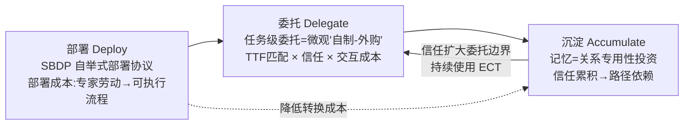
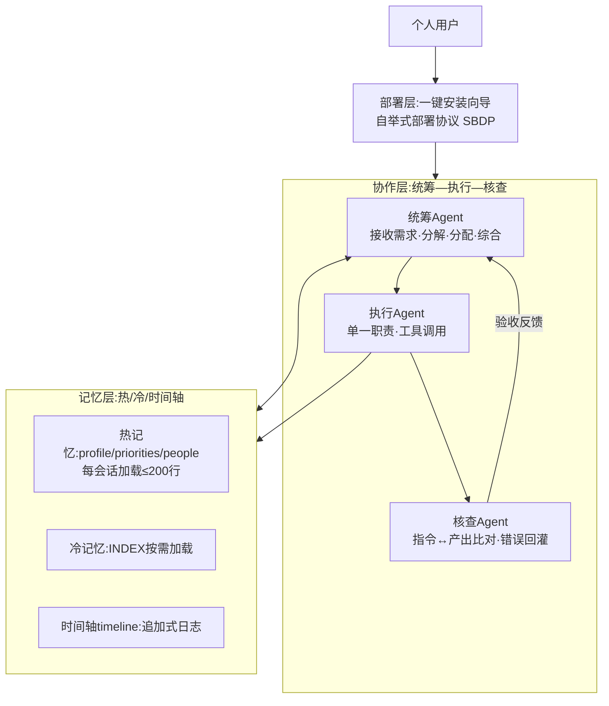
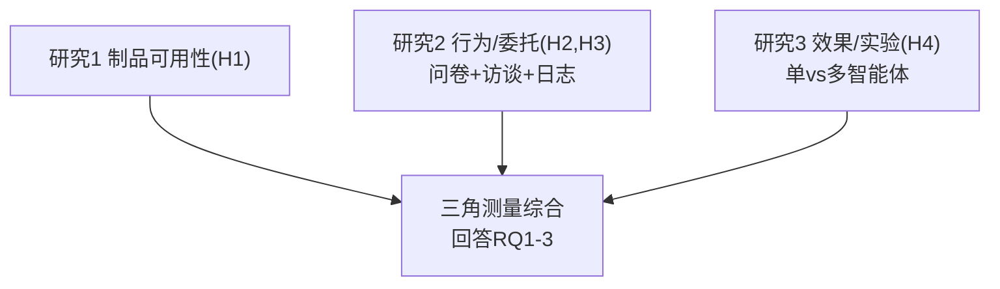

# 早期科研结项 · 研究报告总蓝图
## 《多智能体在个人任务流中的应用：低门槛框架设计与任务级委托决策研究——基于"个人AI幕僚"工作坊的实证》

---

## 目录
1. 核心决策总览
2. 研究定位：背景、问题、贡献
3. 文献与理论体系（六主题）
4. 原创理论框架：DDA 三阶段模型
5. 研究框架与人工制品设计
6. 研究设计与方法
7. 研究报告章节大纲（撰写母本）
8. 结果呈现蓝图
9. 讨论与价值
10. 附件1 填报草稿
11. 参考文献（全量）
12. 评审视角亮点对照
13. 行动清单

---

# 1. 核心决策总览

| 决策项 | 结论 |
|---|---|
| 研究成果形式 | **研究报告** |
| 研究成果标题 | 多智能体在个人任务流中的应用：低门槛框架设计与任务级委托决策研究——基于"个人AI幕僚"工作坊的实证 |
| 一句话方向 | 把工作坊当作**研究田野**、把"一键安装向导"当作**待检验人工制品**，回答：非技术用户能否在真实任务流中采用低门槛多智能体框架？委托了什么、收回了什么、为什么？ |
| 核心命题 | 多智能体进入个人任务流的真正瓶颈不在模型智能，而在**"最后一公里"**——部署门槛与逐任务的委托信任。 |
| 方法论底盘 | 设计科学研究（DSR）+ 案例研究 + 问卷/访谈/日志（行为证据）+ 对比实验（因果证据） |
| 理论标识 | **DDA 三阶段模型**（部署→委托→沉淀），四机制命题 P1–P4 |

## 为什么选"研究报告"（回应评价表 3.1"已完成、符合学术体例"）

| 形式 | 判断 | 理由 |
|---|---|---|
| 学术论文 | ✗ | 期刊论文需规模化创新与同行评审打磨，中期结项强行写易被判定"不完整" |
| **研究报告** | **✓** | 可完整容纳问题→文献→设计→实证→结论→不足，结构即学术体例，与真实经历完全对得上 |
| 文献综述 | ✗ | 你们有真实人工制品与真实用户，只写综述浪费最大优势 |
| 读书报告 | ✗ | 无实证成分 |

---

# 2. 研究定位：背景、问题、贡献

## 2.1 研究背景（三层递进，报告引言照此展开）

**宏观——智能体正从实验室走向每个人的任务流。** 2023年以来，LLM驱动的智能体从单轮对话演变为可多步执行、调用工具、协作分工的"数字劳动力"：MetaGPT以多角色协作完成软件工程，AutoGen以多智能体对话解决复杂推理，Anthropic提出agentic workflows，MCP协议试图标准化智能体工具接口。共识是：**下一战场不在模型能力，而在"如何进入真实任务流"**——部署、编排、记忆与人的信任。

**中观——知识工作者正经历"任务流重构"。** 生成式AI田野实验已给出可靠证据：Noy & Zhang（2023, Science）证明写作任务中AI显著提升生产率与质量；Brynjolfsson 等（2023, NBER）在客服场景发现AI使生产率平均提升约14%；Dell'Acqua 等（2023, HBS）提出"锯齿状技术前沿"——AI能力边界**不平滑、不可预测**，用户必须**逐任务地亲身体验学习"该把什么交给AI"**。这正是"任务级委托决策"的现实起点。

**微观——你们的工作坊是一个真实的"准实验场"。** 2026年4月，"个人AI幕僚"工作坊让非技术背景成员约30分钟内搭建专属Agent（身份定义+记忆系统+协作架构），并配发"一键安装向导"部署协议。它同时具备科研所需的全部要素：人工制品（框架+向导）、真实用户（成员）、真实使用（结项后持续使用）、真实日志（timeline.md）。本研究把这些**重新定义为可检验的科研对象**。

## 2.2 研究问题与可检验假设

| 编号 | 研究问题 | 对应假设 |
|---|---|---|
| **RQ1（设计·部署）** | 统筹—执行—核查三智能体架构与"一键安装向导"自举式部署协议，能否让非技术用户约30分钟内获得可用的个人多智能体框架？ | **H1**：自举式部署协议可使非技术用户独立完成部署（完成率≥【80】%），且部署耗时显著低于传统手动配置。 |
| **RQ2（行为·委托边界）** | 个人用户在真实任务流中如何做出任务级委托/收回决策？委托边界出现在哪些环节、因何形成？ | **H2**：委托率在任务流各环节显著差异（检索/整理/生成环节高，需求界定/判断决策环节低），即"人在边界"。**H3**：曾观察到Agent犯错的环节，后续委托率显著下降（算法厌恶的委托化表现）；记忆积累越多（关系专用性投资越高），委托率与持续使用倾向越高。 |
| **RQ3（效果·验证）** | 标准化任务流上，多智能体相对单智能体在时间投入、人工介入与产出质量上有何可观察差异？ | **H4**：在可分解、多环节、需核查的任务上，多智能体组人工介入时间与迭代次数低于单智能体组且质量不低于基线；在单环节、强主观任务上无显著差异。 |

> 方法论要点：**假设先行**，避免无方向数据挖掘——这是与一般学生报告拉开档次的关键。H2/H3 由问卷+日志+访谈检验；H1/H4 由可用性研究与对比实验检验。

## 2.3 预期贡献（三重）

1. **理论贡献**：①"任务级委托"视角——把TAM/UTAUT的"一次性采纳"推进为"持续的、可收回的、逐任务的委托决策"，用交易成本理论（自制—外购）给出机制；②提出"自举式部署协议（SBDP）"，使**部署成本第一次成为第一等研究变量**；③"记忆→关系专用性投资→路径依赖"机制，解释"专属Agent越用越懂你"。
2. **实践贡献**：经实证检验的低门槛部署方案与五设计原则操作化清单，可转化为普通用户上手指南。
3. **方法贡献**：示范 DSR+案例+问卷/访谈/日志+对比实验的混合方法在本科早期科研的完整落地。

---

# 3. 文献与理论体系（六主题）

> 写作原则：每个理论只服务一个研究问题，按"问题—文献—缺口—本研究回应"组织，**绝不罗列**。

## 3.1 多智能体系统与任务流架构
- **核心文献**：CAMEL（Li et al., 2023）角色扮演协作；MetaGPT（Hong et al., 2024）多角色SOP流水线；AutoGen（Wu et al., 2024）多智能体对话；ReAct（Yao et al., 2023）推理-行动；Reflexion（Shinn et al., 2023）与Self-Refine（Madaan et al., 2023）自验证；LLM-as-a-Judge（Zheng et al., 2023）；Anthropic《Building Effective Agents》（2024）的 orchestrator-workers 与 evaluator-optimizer；MCP（2024）工具接口标准化。
- **对照定位**：现有架构面向**开发者**，无人系统研究"非技术用户部署环节"。你们的统筹—执行—核查可定位于 orchestrator-workers + evaluator-optimizer 的组合；独特处：①文档自举取代代码配置；②叠加个人记忆层；③验收闭环（核查回灌统筹）。
- **缺口**：多智能体"何时优于单智能体"缺任务级实证；"部署成本"几乎未被作为变量。→ RQ1、RQ3。

## 3.2 智能体记忆与个性化
- **核心文献**：Generative Agents（Park et al., 2023）记忆流+反思+检索；MemGPT（Packer et al., 2023）操作系统式上下文分层；MemoryBank（Zhong et al., 2023）长期记忆库；RAG（Lewis et al., 2020）。
- **对照定位**：你们的**热/冷/时间轴**与 Park 记忆分层、MemGPT 层级管理同构，但落地为**纯文件协议**（零数据库、人类可读、可迁移）。
- **缺口**：记忆对**用户委托行为**的因果影响缺乏实证。→ H3（最可能"让老师眼前一亮"的假设）。

## 3.3 人机信任、委托与生成式AI实证
- **核心文献**：Lee & See（2004）信任校准与适当依赖；Dietvorst et al.（2015）算法厌恶（**给人类"修正权"能缓解厌恶**）；Skitka et al.（1999）自动化偏见；Dell'Acqua et al.（2023）锯齿状前沿；Noy & Zhang（2023, Science）；Brynjolfsson et al.（2023, NBER）。
- **对照定位**：你们PPT"AI能做什么不能做什么"=锯齿状前沿的口语化；"收回委托"=算法厌恶与信任失校；"核查Agent"=内置"修正权"缓解厌恶。**文献缺口**：上述理论几乎全部来自实验室/单轮任务，缺"个人专属智能体+长期使用+任务级委托"的证据。→ RQ2、H2/H3。

## 3.4 信息系统采纳、持续使用与组织理论（信管正宗）
- **核心文献**：TAM（Davis, 1989）；UTAUT（2003）/UTAUT2（2012）；期望确认持续使用模型 ECT（Bhattacherjee, 2001）——**注意：评价的是结项后是否仍在用，本质是"持续使用"而非首次采纳，ECT必引**；任务-技术匹配 TTF（Goodhue & Thompson, 1995）——**"任务级委托"最直接的理论母体**；交易成本经济学（Williamson, 1985）——**委托Agent=外购、自做=自制；部署/学习成本=转换成本；记忆积累=关系专用性投资**；自适应结构化理论 AST（DeSanctis & Poole, 1994）与技术实践（Orlikowski, 2000）——成员"挪用"框架（改向导、自定义记忆、自建persona）；任务复杂性（Wood, 1986）；认知负荷（Sweller, 1988）。
- **整合**：TTF（任务匹配）+ 交易成本（自制-外购+专用性投资）+ ECT（持续使用）+ 算法厌恶（行为偏差）→ 统一为 DDA 模型（见第4部分）。

## 3.5 任务流分析与知识工作
- 知识工作流程建模（检索→整理→分析→综合→写作→决策）；BPM/工作流文献作"任务流"概念的方法论来源；认知负荷理论解释委托动机。

## 3.6 文献述评的结构（报告第二章的写法）
每主题按四段式：①该领域回答什么问题；②代表性研究及其方法；③与本研究的关系（支撑/对比）；④留下的缺口。最后以"缺口汇总表"收束到 DDA 模型。

---

# 4. 原创理论框架：DDA 三阶段模型

## 4.1 模型图

## 4.2 四个机制命题（对应假设）
- **P1（部署→委托的触发）**：部署成本是委托行为的首要门槛；自举式部署协议压缩部署成本→提高委托起始率。（H1）
- **P2（委托边界的形成）**：每环节委托决策=能力感知（TTF）×信任（Lee & See）×交互成本（交易成本）的三元判断；失败经历经"算法厌恶"压低该环节委托率→形成稳定委托边界曲线。（H2）
- **P3（沉淀→信任的累积）**：记忆形成关系专用性投资：投入越多→转换成本越高+越了解用户→信任越高→委托率上升（路径依赖）；ECT机制（确认→满意）维持持续使用。（H3）
- **P4（架构的边界）**：多智能体在"可分解、多环节、需核查"任务上优于单智能体（专业化收益>协调成本）；在"单环节、强主观"任务上无优势甚至劣势。（H4）

> **DDA 是本研究区别于一切"应用报告"的学术标识**——它把五个设计原则、三个研究问题、四组假设统一在一个可证伪的机制模型里。

---

# 5. 研究框架与人工制品设计

## 5.1 三层架构

**设计要旨**：部署层解决"能不能用起来"（H1）；协作层解决"靠不靠谱"（H4）；记忆层解决"越用越懂你"（H3）。三层各回答一个RQ。

## 5.2 协作层对照表

| 维度 | 本框架 | MetaGPT | AutoGen | Anthropic | 差异点 |
|---|---|---|---|---|---|
| 角色 | 3个固定职责角色 | 多角色SOP流水线 | 对话群聊动态角色 | orchestrator-workers+evaluator-optimizer | 固定三角，零开发成本 |
| 质检 | 核查Agent验收闭环 | SOP内校验 | 靠对话共识 | evaluator-optimizer | 验收是显式第三角色 |
| 记忆 | 独立三层记忆 | 无 | 无内建长期记忆 | 依赖外部工具 | 记忆是第一等公民 |
| 部署 | **文档自举（SBDP）** | 代码+API | 代码+API | 代码框架 | 非技术用户30分钟可用 |

## 5.3 部署层：SBDP（独特人工制品）
**定义**：SBDP（Self-Bootstrapping Deployment Protocol）——以**文档为载体、由智能体自主执行**的部署协议：用户提供文档→智能体按协议依次完成（两轮合并收集参数→创建入口文件→创建记忆目录→Bootstrap引导访谈→写入记忆档案→完成宣告）。
**为什么是"文档即程序"**：传统部署是专家劳动；SBDP 把部署知识编码进可执行文档，执行者是智能体自己——**部署从"专家配置"变成"自举执行"**。相对MCP（工具接口标准化）：SBDP标准化个人配置与部署流程；相对.agent.md/CLAUDE.md（静态配置）：SBDP是动态、自执行、产出配置+记忆+人格的元文档；相对prompt engineering（单点技巧）：SBDP是可度量的系统化协议（完成率、耗时、失败点）。
**可用性检验（H1）**：招募【3–5】名未参加过工作坊的非技术被试，仅凭向导独立部署，测量完成率/耗时/求助点/SUS（≥【68】分可用）。同时消除选择偏差。

## 5.4 记忆层对照表

| 本框架 | Park et al. 2023 | MemGPT | 定位差异 |
|---|---|---|---|
| 热记忆（每会话加载） | 记忆流近期高相关记忆 | 主上下文 | 纯文件、零数据库 |
| 冷记忆（INDEX按需） | 反思后长期记忆 | 外存分页 | 人类可读、可迁移 |
| timeline追加日志 | 记忆流时间戳 | 事件序列 | 显式可审计 |

## 5.5 五设计原则操作化

| 原则 | 设计要点 | 可测量化 |
|---|---|---|
| 灵魂 | 身份定义、铁律、心智模型 | 访谈编码：用户是否感知"个性/立场"（3题量表） |
| 记忆 | 热/冷/时间轴分层 | 记忆文件行数/更新频次（日志直接可测） |
| 成长 | 每会话更新、起点更高 | timeline连续性、更新一致率 |
| 协作 | 统筹-执行-核查职责分离 | 委托链长度、角色切换频次 |
| 验收 | 核查闭环、螺旋迭代 | 迭代轮数、修正率、验收通过率 |

---

# 6. 研究设计与方法

## 6.1 总体设计：DSR + 混合方法
按 Peffers et al.（2007）六步：问题识别→目标定义→设计开发（框架+向导）→演示（工作坊）→评价（本研究）→沟通（报告）。评价阶段用**收敛三角测量**。

## 6.2 研究1：部署可用性（RQ1/H1）
非工作坊成员【3–5】人，仅凭向导独立部署；记录完成率/耗时/求助点；SUS量表；产出向导迭代改进清单。

## 6.3 研究2：采纳、委托边界与持续使用（RQ2/H2,H3）
**问卷**（问卷星，匿名，7点李克特）：
- 使用现状（是否在用/频率/时长）；PU（4题，Davis 1989）、PEOU（4题）、感知信任（4题，改编Lee & See）、感知风险（3题）、持续使用意向（3题，改编Bhattacherjee 2001）；
- 委托任务类型（按七环节多选）+ 收回原因（能力不足/输出不可靠/不省时间/隐私顾虑/情感需求/其他）；
- 记忆感知（3题："它记得我"、个性化、更换成本）；
- 质量控制：反向题1–2道、测谎项、报告Cronbach's α。

**半结构化访谈**（【3–5】人，20–30分钟）：
1. 你的Agent现在还用吗？主要做什么？
2. 举一个最成功/最失败的一次委托，发生了什么？
3. 哪些任务试过又收回了？为什么？
4. "它记得你"对使用有影响吗？
5. 换一个通用AI，你会损失什么？
6. 你希望它能做什么、绝对不希望它做什么？

**日志内容分析**（timeline.md/对话记录）：
- 分析单元：一次**委托事件**；编码维度：任务流环节（七类）、结果（成功/部分/撤回/失败）、失败原因（六类）、迭代次数；
- 信度：2名编码者独立编码20%样本，Cohen's κ≥0.70；
- 产出：**委托边界曲线** + 委托-收回事件流。

## 6.4 研究3：单 vs 多智能体对比实验（RQ3/H4）
- **被试内设计** + 任务顺序**交叉抵消**；
- 任务A（检索整理型）：给定主题→检索→结构化笔记；任务B（分析型）：给定小数据集→清洗→统计→要点；任务C（写作综合型）：给定材料→800字综述；
- 条件：单智能体（无记忆、单轮）vs 多智能体（统筹-执行-核查+记忆）；
- 指标：总时长、**人工介入次数与时长**、产出质量（双人盲评：相关性/准确性/结构/完整性，5点）、用户感知；
- 样本：每组【3–5】次，共【10–15】次有效运行；配对比较（Wilcoxon符号秩检验），报告效应量与描述统计。

## 6.5 任务流七环节模型（RQ2操作化工具）

**理论预期（可证伪）**：委托率呈"哑铃型"——中间环节高、两端低（"人在边界"）。**数据不支持本身就是发现**。

## 6.6 数据采集清单

| 数据 | 工具 | 周期 | 优先级 |
|---|---|---|---|
| 部署可用性（研究1） | 现场/远程观察+SUS | 1周 | 高 |
| 问卷（研究2） | 问卷星 | 2–3天回收 | 高 |
| 访谈（研究2） | 录音+转写 | 1周 | 高 |
| 日志（研究2） | 成员导出 | 随问卷 | 中 |
| 对比实验（研究3） | 标准化脚本 | 1周 | 最高 |
| 纵向对照 | 4月工作坊记录 vs 现在 | 已有 | 免费加分 |

## 6.7 伦理与合规（评价表4.1/4.2直接回应）
①知情同意（问卷首页说明/访谈录音征得同意/日志征得许可）；②脱敏（匿名化、去标识）；③数据边界（不采集不上传机构保密信息，与南大AI使用指导意见一致）；④AI使用披露（如实声明辅助范围，核心工作本人完成）；⑤引用规范（GB/T 7714）；⑥贡献边界（工作坊素材注明来源，本人研究性贡献明确区分）。

---

# 7. 研究报告章节大纲（撰写母本）

> 总篇幅建议 8000–12000 字（正文），加附录。每章给出内容要点与写作提示。

## 第一章 引言（约1500字）
- 1.1 研究背景与问题提出：三层递进（宏观智能体化→中观任务流重构→微观工作坊），最后落到"部署门槛与委托信任"这一核心问题；
- 1.2 研究问题与假设：RQ1–3、H1–4（表格呈现）；
- 1.3 研究意义与贡献：理论/实践/方法三重贡献。
- **写作提示**：倒金字塔开篇，第一段就给出核心命题；不写"随着AI时代来临……"式空话；问题意识要在前三段内让读者感到。

## 第二章 文献综述与理论框架（约2500字）
- 2.1 多智能体系统与任务流架构（3.1）
- 2.2 智能体记忆与个性化（3.2）
- 2.3 人机信任、委托与生成式AI实证（3.3）
- 2.4 信息系统采纳、持续使用与组织理论（3.4）
- 2.5 文献述评与研究缺口（3.6）
- 2.6 DDA 三阶段模型与命题（第4部分）
- **写作提示**：每个主题四段式；**本章结尾必须让读者认同"这项研究非做不可"**。

## 第三章 研究设计与方法（约2000字）
- 3.1 总体设计（DSR六步+三角测量图）
- 3.2 研究1：部署可用性（被试/流程/指标）
- 3.3 研究2：问卷（量表来源与题数）/访谈（提纲见附录）/日志（编码方案）
- 3.4 研究3：对比实验（设计/任务/指标/盲评）
- 3.5 伦理与合规声明
- **写作提示**：方法与RQ一一对应，量表必须标注改编来源；写清质量控制（反向题、双编码者κ、盲评）。

## 第四章 研究发现（约3000字+图表）
- 4.1 研究1结果：部署可行性（表格）
- 4.2 研究2结果：委托边界曲线、委托-收回事件流、假设检验表、2–3个典型案例叙事
- 4.3 研究3结果：对比表+效应量
- **写作提示**：先表后文、一图一表一结论；每个假设一个明确判定（支持/部分支持/不支持+解释）。

## 第五章 讨论（约2000字）
- 5.1 对RQ1–3的回答（证据链）
- 5.2 与文献对话：支持/修正/延伸（如：委托边界曲线支持锯齿状前沿；失败后收回支持算法厌恶的生态位推广）
- 5.3 DDA机制阐述与模型边界（何时不成立）
- 5.4 实践启示（给普通用户的委托策略建议）

## 第六章 结论与展望（约800字）
- 6.1 结论（三段式：做了什么/发现什么/贡献什么）
- 6.2 局限（第9部分F3）
- 6.3 展望（跨群体、组织级任务流、更大规模实验）

## 参考文献（GB/T 7714）
## 附录：问卷全文、访谈提纲、编码表、向导文档、实验脚本

## 7.1 写作规范速查
- **语言**：客观、精准、非评价性（"结果显示"而非"令人惊喜地"）；研究意义只在引言与讨论出现；
- **图表**：每张图表编号+标题+在正文首次提及；坐标轴标注单位；
- **假设检验表述**：给出统计量、p值/效应量、判定三件套；
- **引用**：正文标注与参考文献一一对应；原创观点与引用界限清晰；
- **AI使用披露**：在方法章节末尾或致谢处如实声明（检索/整理/润色范围）。

---

# 8. 结果呈现蓝图

## 8.1 研究1表格
| 被试 | 完成率 | 耗时(min) | 求助点 | SUS |
|---|---|---|---|---|
| 【】 | 【】 | 【】 | 【】 | 【】 |

## 8.2 研究2四张核心图
1. 委托边界曲线（七环节×委托率柱状图，H2直接证据）；
2. 委托-收回事件流（横向时间线，标注委托/收回/失败）；
3. 假设检验表（假设→变量→统计量→结果→判定）；
4. 典型叙事（2–3个"最成功/最失败委托"小案例，质的证据）。

## 8.3 研究3对比表
| 指标 | 单智能体(M±SD) | 多智能体(M±SD) | 差异检验 |
|---|---|---|---|
| 总时长 | 【】 | 【】 | 【】 |
| 人工介入次数 | 【】 | 【】 | 【】 |
| 产出质量(盲评) | 【】 | 【】 | 【】 |

## 8.4 讨论"三段式"
①逐条回答RQ（数据→结论）→②与文献对话（支持/修正/延伸）→③DDA机制阐述+模型边界。

---

# 9. 讨论与价值

## 9.1 理论贡献
- 采纳理论粒度推进：系统级采纳→任务级委托（TAM/UTAUT→TTF×交易成本）；
- 部署成本变量化：SBDP概念化多智能体研究的"最后一公里"；
- 记忆的机制解释：关系专用性投资→路径依赖（Williamson在AI场景的新应用）；
- 算法厌恶的情景化：从实验室单任务到真实长期使用（外部效度贡献）。

## 9.2 实践贡献
- 可复制部署方案（向导即交付物）；五原则→可操作设计清单；"人在边界"委托策略建议。

## 9.3 局限与展望（学术化）
1. **样本与情境**：单次工作坊、样本小、单一高校情境→外部效度受限；展望跨群体、跨组织。
2. **测量**：问卷自报告存在共同方法偏差——已用匿名、反向题、三角测量缓解；日志口径因平台异构不一致——用编码规则统一。
3. **因果识别**：观察数据难以严格因果推断——对比实验提供部分因果证据，但样本小；展望更大规模随机实验。
4. **时效性**：大模型快速迭代，"锯齿状前沿"在移动——结论有时间戳属性，注明数据收集期。
5. **新颖性效应**：早期使用可能受新鲜感驱动（霍桑效应）——纵向追踪缓解。

---

# 10. 附件1 填报草稿（一页以内）

**研究成果标题**：多智能体在个人任务流中的应用：低门槛框架设计与任务级委托决策研究——基于"个人AI幕僚"工作坊的实证

**研究成果形式**：🗹 研究报告

**研究成果概述**（客观、精准、非评价性）：
> 本研究以多智能体技术在个人任务流中的应用为对象，针对非技术用户部署多智能体系统门槛高的问题，基于2026年4月"个人AI幕僚"工作坊的实践，形式化提出"统筹—执行—核查"三智能体协作架构与自举式部署协议（一键安装向导），并整合提出"部署—委托—沉淀"三阶段模型。研究采用设计科学方法与混合研究设计：通过部署可用性测试检验协议可行性；通过问卷调查（有效问卷【N】份）、半结构化访谈（【N】人）与使用日志内容分析考察成员的采纳行为与任务级委托边界；通过标准化任务对比实验（单智能体与多智能体各【N】次）检验效果差异。结果显示：【据实填写：持续使用比例、各环节委托率分布、失败后收回行为、对比实验差异等】。

**研究成果关键词**：多智能体；任务流；任务级委托；自举式部署；持续使用

**研究过程概述（含研究方法）**：
> 选题阶段，结合导师课题"Multi Agent在任务流中的应用"与本人主持工作坊的实践，将课题操作化为框架设计、部署协议与任务级委托三个研究问题，并基于技术采纳、任务-技术匹配与交易成本理论提出可检验假设；文献阶段，于ACM Digital Library、arXiv、中国知网检索多智能体协作、智能体记忆、人机信任与信息系统采纳文献，归纳研究缺口；数据阶段，设计并发放问卷，开展半结构化访谈，收集成员Agent使用日志并建立七环节编码方案，设计并执行单/多智能体标准化对比实验与部署可用性测试；分析阶段，对访谈与日志进行主题编码与双编码者信度检验，对实验数据作描述统计与配对比较，依据证据回答研究问题并讨论理论机制与局限。

**不足与展望**：
> 本研究样本来自单次工作坊，样本量小、观察周期短，结论外推受限；自报告数据存在共同方法偏差，日志口径因平台异构不完全一致；对比实验任务类型与次数有限。展望：扩大样本并纵向追踪，扩展至组织级任务流，增加任务类型与基线对照，进一步检验"部署—委托—沉淀"模型的适用边界。

**承诺**：勾选"是，同步申请结项"前，确认数据真实、引用规范、AI使用已披露、贡献边界清晰。

---

# 11. 参考文献（全量 · 须自行核验卷期页码）

## 多智能体系统
1. Park J S, et al. Generative Agents: Interactive Simulacra of Human Behavior[C]. UIST, 2023.
2. Hong S, et al. MetaGPT: Meta Programming for A Multi-Agent Collaborative Framework[C]. ICLR, 2024.
3. Wu Q, et al. AutoGen: Enabling Next-Gen LLM Applications via Multi-Agent Conversation[C]. COLM, 2024.
4. Li G, et al. CAMEL: Communicative Agents for "Mind" Exploration of Large Language Model Society[C]. NeurIPS, 2023.
5. Yao S, et al. ReAct: Synergizing Reasoning and Acting in Language Models[C]. ICLR, 2023.
6. Shinn N, et al. Reflexion: Language Agents with Verbal Reinforcement Learning[C]. NeurIPS, 2023.
7. Madaan A, et al. Self-Refine: Iterative Refinement with Self-Feedback[C]. NeurIPS, 2023.
8. Zheng L, et al. Judging LLM-as-a-Judge with MT-Bench and Chatbot Arena[C]. NeurIPS, 2023.
9. Anthropic. Building Effective Agents[EB/OL]. 2024.
10. Anthropic. Model Context Protocol[EB/OL]. 2024.

## 智能体记忆与检索
11. Packer C, et al. MemGPT: Towards LLMs as Operating Systems[EB/OL]. arXiv:2310.08560, 2023.
12. Zhong W, et al. MemoryBank: Enhancing Large Language Models with Long-Term Memory[EB/OL]. arXiv:2305.10250, 2023.
13. Lewis P, et al. Retrieval-Augmented Generation for Knowledge-Intensive NLP Tasks[C]. NeurIPS, 2020.

## 人机信任、委托与生成式AI实证
14. Lee J D, See K A. Trust in Automation: Designing for Appropriate Reliance[J]. Human Factors, 2004, 46(1): 50-80.
15. Dietvorst B J, Simmons J P, Massey C. Algorithm Aversion: People Erroneously Avoid Algorithms After Seeing Them Err[J]. Journal of Experimental Psychology: General, 2015, 144(1): 114-126.
16. Skitka L J, Mosier K L, Burdick M. Does Automation Bias Decision-Making?[J]. International Journal of Human-Computer Studies, 1999, 51(5): 991-1006.
17. Dell'Acqua F, et al. Navigating the Jagged Technological Frontier[R]. Harvard Business School Working Paper, 2023.
18. Noy S, Zhang W. Experimental Evidence on the Productivity Effects of Generative Artificial Intelligence[J]. Science, 2023, 381(6654): 187-192.
19. Brynjolfsson E, Li D, Raymond L. Generative AI at Work[R]. NBER Working Paper No. 31161, 2023.

## 信息系统采纳、持续使用与组织理论
20. Davis F D. Perceived Usefulness, Perceived Ease of Use, and User Acceptance of Information Technology[J]. MIS Quarterly, 1989, 13(3): 319-340.
21. Venkatesh V, et al. User Acceptance of Information Technology: Toward a Unified View[J]. MIS Quarterly, 2003, 27(3): 425-478.
22. Venkatesh V, Thong J Y L, Xu X. Consumer Acceptance and Use of Information Technology: Extending the Unified Theory of Acceptance and Use of Technology[J]. MIS Quarterly, 2012, 36(1): 157-178.
23. Bhattacherjee A. Understanding Information Systems Continuance: An Expectation-Confirmation Model[J]. MIS Quarterly, 2001, 25(3): 351-370.
24. Goodhue D L, Thompson R L. Task-Technology Fit and Individual Performance[J]. MIS Quarterly, 1995, 19(2): 213-236.
25. DeSanctis G, Poole M S. Capturing the Complexity in Advanced Technology Use: Adaptive Structuration Theory[J]. Organization Science, 1994, 5(2): 121-147.
26. Orlikowski W J. Using Technology and Constituting Structures: A Practice Lens for Studying Technology in Organizations[J]. Organization Science, 2000, 11(4): 404-428.
27. Williamson O E. The Economic Institutions of Capitalism[M]. New York: Free Press, 1985.
28. Wood R E. Task Complexity: Definition of the Construct[J]. Organizational Behavior and Human Decision Processes, 1986, 37(1): 60-82.
29. Sweller J. Cognitive Load During Problem Solving: Effects on Learning[J]. Cognitive Science, 1988, 12(2): 257-285.

## 研究方法
30. Hevner A R, et al. Design Science in Information Systems Research[J]. MIS Quarterly, 2004, 28(1): 75-105.
31. Peffers K, et al. A Design Science Research Methodology for Information Systems Research[J]. Journal of Management Information Systems, 2007, 24(3): 45-77.
32. Yin R K. Case Study Research: Design and Methods[M]. 5th ed. Thousand Oaks: Sage, 2014.

## 中文文献检索建议（知网，至少3–5篇）
- "大语言模型 智能体"综述（近3年）；"多智能体 协作 大模型"；
- "生成式人工智能 知识工作 生产率"；"人机协同 决策 信任"；
- "算法厌恶"；"技术接受模型 人工智能 实证"；"ChatGPT 持续使用 行为"；
- **康乐乐教授及课题团队近三年论文**（学院官网/知网，术语对齐）。

---

# 12. 评审视角亮点对照（结项评价表）

| 评分项 | 本方案如何拿分 |
|---|---|
| 1.1/1.2 投入与主动 | 主动检索、主动设计实验与访谈、主动迭代向导——过程概述如实呈现 |
| 2.1 文献与信息处理 | 六主题文献体系；中文+英文；"缺口→回应"逻辑 |
| 2.2 问题分析与方案 | 三个RQ+四个可检验假设；DDA理论模型（最强证据） |
| 2.3 沟通协作 | 工作坊本身就是协作证据；报告逻辑清晰可汇报 |
| 3.1 成果完整 | 研究报告六章+附录（问卷/访谈提纲/编码表/向导文档/实验脚本） |
| 3.2 学术价值 | 任务级委托视角+SBDP概念+DDA模型，呼应前沿并推进采纳理论 |
| 3.3 逻辑呈现 | 问题意识明确、假设-证据-结论链条连贯 |
| 4.1/4.2 规范诚信 | 伦理六条合规设计；贡献边界清晰；AI使用披露 |

---

# 13. 行动清单（执行顺序）

- [ ] **1. 对比实验（最高优先）**：定3个标准化任务→单/多智能体各跑3–5次→双人盲评（1周）
- [ ] **2. 问卷**：按6.3设计20题内问卷→问卷星发放→回收（2–3天）
- [ ] **3. 访谈**：约3–5位成员，按6.3提纲，录音+转写（1周）
- [ ] **4. 日志**：请成员导出timeline.md/对话记录→按编码方案分析（与访谈并行）
- [ ] **5. 部署可用性测试**：招募3–5名非成员，SUS量表（1周）
- [ ] **6. 数据整理**：统一表格，统计检验（Wilcoxon、描述统计、κ信度）
- [ ] **7. 撰写报告**：按第7章大纲逐章写（先引言+文献→方法→结果→讨论）
- [ ] **8. 合规自查**：引用核验、AI使用披露、贡献边界、脱敏
- [ ] **9. 填附件1**：按第10部分草稿，控制一页
- [ ] **10. 提交前自查**：对照第12部分逐项打钩
