# Calibrated Delegation in Personal Multi-Agent Workflows

## Deployment, Task Boundaries, and Continued Use

Runjie Sun  
School of Information Management, Nanjing University

## Abstract

The practical value of personal multi-agent systems depends on more than model capability. Users must first deploy a working configuration and then decide, repeatedly, which parts of a workflow to delegate, monitor, or reclaim. This study examines those problems in the setting of an April 2026 workshop on personal AI chief-of-staff systems. The evaluated artifact combined a document-guided Self-Bootstrapping Deployment Protocol (SBDP), an orchestration-execution-verification architecture, and file-based personal memory. The design-science evaluation comprised five observed deployment attempts, an anonymous post-workshop survey, 327 coded usage events from 13 users, a linked memory sample, and a within-participant pilot comparing single-agent and multi-agent configurations across three tasks. Twenty-nine of 30 survey responses passed an instructed-response attention check. Delegation rates differed across seven workflow stages, Cochran's Q(6) = 54.23, p < .001, with information retrieval and content generation delegated most frequently and problem definition and judgment/decision delegated least frequently. In the primary user-aggregated specification, delegation frequency within an affected stage declined after the first failed or partially successful event, W = 1.5, exact p = .0015, n = 12. In a linked sample of 13 users, timeline length and memory-update frequency were strongly associated with continuance intention, Spearman rho = .850 and .781, respectively. The comparative pilot produced directionally favorable time and intervention differences for multi-agent workflows on decomposable tasks, but four paired observations per task preclude confirmatory superiority or non-inferiority claims. The study develops the Deploy-Delegate-Accumulate (DDA) model as a process account connecting deployment, recurrent task allocation, and accumulated user-specific memory. The evidence provides an initial probe of the model while leaving causal mechanisms, generalizability, and comparative performance for larger studies.

**Keywords:** personal multi-agent systems; task-level delegation; trust calibration; continued use; design science research; human-AI collaboration

## 1. Introduction

### 1.1 Background and research problem

Large language model agents can execute multiple steps, call tools, divide work among specialized roles, evaluate outputs, and retain persistent context. These capabilities have encouraged a shift from conversational assistance toward delegated work. Yet an agent's capacity to act does not determine whether a person will incorporate it into an everyday workflow. Two decisions precede practical use. The user must first establish a working configuration, and then decide which parts of each task can be assigned to the system without creating more communication, checking, or correction work than the delegation saves.

Research on generative AI has established that performance effects depend on the task and work setting. In professional writing, access to ChatGPT reduced completion time and improved evaluated quality (Noy & Zhang, 2023). In customer support, generative AI increased productivity, with larger gains among less experienced workers (Brynjolfsson et al., 2025). Dell'Acqua et al. (2026) showed that the same technology can improve performance on tasks within its capability boundary and impair performance outside it. Their account of a jagged technological frontier implies that users cannot infer reliability from a general statement about AI capability; they must learn how performance varies across tasks.

Most agent research approaches this problem from the system side. Multi-agent frameworks demonstrate role-based cooperation, tool use, iterative evaluation, and memory (Li et al., 2023; Hong et al., 2024; Wu et al., 2024). These studies establish technical possibilities, but they often begin after a system has already been configured and a task has already been assigned. Deployment effort and the user's allocation of authority remain outside the main analytical frame. Human-AI research, meanwhile, has long distinguished appropriate reliance from either blanket trust or blanket rejection (Lee & See, 2004). The remaining opportunity is to connect deployment, stage-specific delegation in sustained personal use, experience-based withdrawal, and accumulated memory within one traceable design-science study.

The field setting was the *Personal AI Chief of Staff* workshop held at Nanjing University in April 2026. Participants without a technical background used a guided installation document to establish a personal agent framework in approximately 30 minutes. The artifact included identity definitions, persistent memory, and a collaboration architecture; subsequent everyday use generated longitudinal records. This setting supplied the core elements of design science research: a testable artifact, real users, and observed use outside a purely synthetic benchmark.

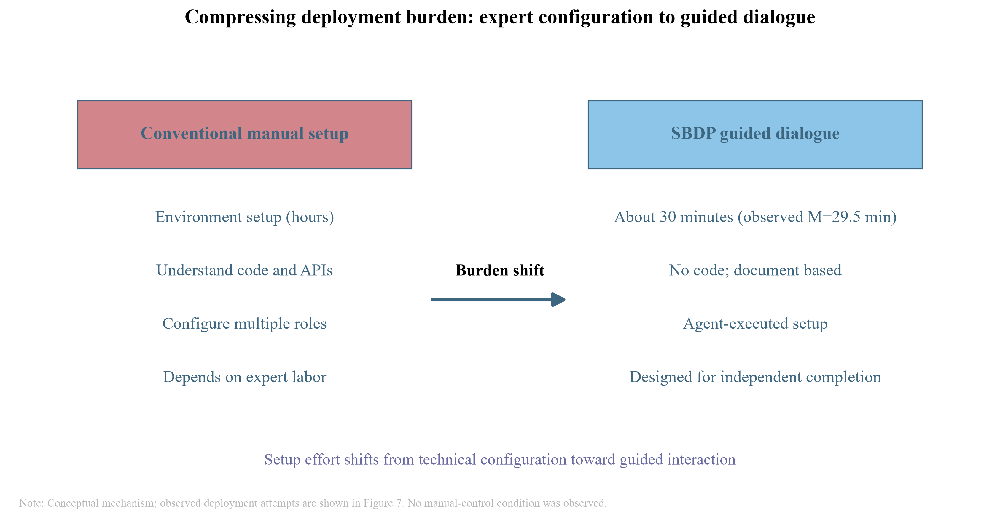

*Figure 1. Compression of deployment burden from expert configuration to guided interaction. The diagram describes the intended burden shift; no manual-configuration control condition was observed.*

### 1.2 Research questions and hypotheses

The study addresses three research questions.

1. Can a document-guided self-bootstrapping protocol enable non-technical users to deploy a usable personal multi-agent configuration with limited assistance?
2. How do users allocate and withdraw delegation across workflow stages, and how are those decisions associated with experienced failures and accumulated memory?
3. What differences in time, human intervention, and blind-rated quality are observable between single-agent and multi-agent configurations across tasks with different structures?

| Study | Research question | Hypothesis or evaluative expectation | Principal evidence |
| --- | --- | --- | --- |
| Study 1 | RQ1: deployment feasibility | H1: at least four of five participants complete deployment; successful attempts are near 30 minutes and reach a usable SUS range | Completion, elapsed time, assistance points, SUS |
| Study 2 | RQ2: delegation and continued use | H2: delegation rates differ across seven workflow stages | Valid survey responses, N = 29 |
| Study 2 | RQ2: failure-linked recalibration | H3a: delegation in an affected stage is lower after the first unsuccessful event | 327 events; primary user-level paired analysis, n = 12 |
| Study 2 | RQ2: memory and continuance | H3b: memory accumulation is positively associated with continuance intention | Linked memory-survey records, n = 13 |
| Study 3 | RQ3: comparative workflow performance | H4: multi-agent coordination is most useful for decomposable, multi-stage, verifiable tasks | Four paired participants per task |

### 1.3 Contributions and evidentiary scope

The research makes three bounded contributions. First, it develops the Deploy-Delegate-Accumulate (DDA) model, which treats personal-agent use as a process rather than a one-time adoption decision. Second, it evaluates deployment as an observable design problem using completion, time, assistance, failure points, and usability responses. Third, it combines survey selections with coded longitudinal events, linked memory indicators, and a controlled pilot. These contributions concern analytical integration and traceability. The available samples do not support claims of a validated general theory, a universal delegation boundary, or a stable population-level performance advantage.

## 2. Literature and theoretical foundation

### 2.1 Multi-agent workflows and verification

Language-agent architectures organize model calls and tools into repeatable patterns. ReAct interleaves reasoning and action (Yao et al., 2023); CAMEL uses role-playing to study cooperation between communicative agents (Li et al., 2023); MetaGPT encodes role-specific workflows through standardized operating procedures (Hong et al., 2024); and AutoGen supports applications built from multi-agent conversations (Wu et al., 2024). Reflexion and Self-Refine add feedback-based iteration (Shinn et al., 2023; Madaan et al., 2023), while research on model-based evaluators examines the conditions under which an LLM can judge another model's output (Zheng et al., 2023).

The artifact examined here combines an orchestrator that allocates and integrates work, specialized executors that complete bounded subtasks, and a verifier that compares outputs with the request before discrepancies are returned. Its distinctive feature is not the invention of role specialization. The design question is whether a fixed, low-configuration arrangement can be deployed and used by people without a technical background, and whether its coordination costs are justified for the task at hand.

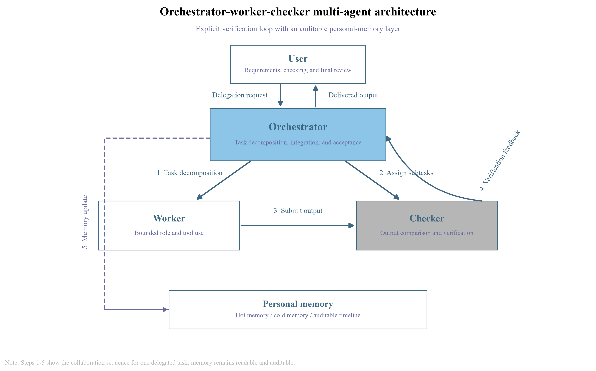

*Figure 2. Orchestrator-executor-verifier architecture. Separation of allocation, execution, and checking is intended to preserve traceability and correction authority.*

Multi-agent systems may create value when specialization and independent checking exceed the added coordination burden. This inequality is likely to depend on task decomposability, the number of linked stages, and whether quality can be checked against explicit criteria. A multi-agent configuration may add little to a short, subjective task, and it may perform worse if orchestration introduces delay or dilutes the user's intent. The comparative pilot therefore treats task structure as a boundary condition rather than assuming a universal multi-agent advantage.

### 2.2 Memory, personalization, and switching costs

Persistent memory allows an agent to carry context beyond a single session. Generative Agents organizes memories by recency, importance, and relevance and introduces reflection over accumulated experience (Park et al., 2023). MemGPT treats context management as a hierarchy between limited active context and external storage (Packer et al., 2023). MemoryBank similarly supports long-term conversational memory (Zhong et al., 2023), while retrieval-augmented generation provides a general mechanism for incorporating stored information into model output (Lewis et al., 2020).

The system studied here implements memory through ordinary files: frequently loaded records for profile, priorities, people, and preferences; an append-only timeline; and an index of colder records. Human-readable storage makes accumulated context inspectable and portable, although it does not guarantee that retrieval or model interpretation will be accurate.

Memory accumulation has at least two plausible relationships with continued use. It may increase functional fit because the user repeats less context and receives more personalized output. It may also create relationship-specific investment in the sense of transaction cost economics: leaving the system means losing curated context and shared conventions (Williamson, 1985). The present data cannot distinguish these paths. A positive association with continuance is compatible with both and may also reflect a simpler selection process in which already-engaged users create more memory.

### 2.3 Task-technology fit and recurrent delegation

Task-technology fit theory argues that performance effects depend on correspondence between task requirements and technological functionality (Goodhue & Thompson, 1995). Applied at the stage level, this implies that a user need not adopt or reject an agent as a whole. Information retrieval, organization, analysis, drafting, execution, and judgment place different demands on factual accuracy, context, verifiability, and authority. A single workflow can therefore contain both highly delegable and non-delegable segments.

Transaction costs add a decision mechanism to this fit account. Delegation requires specifying the task, transferring context, monitoring progress, and checking the result. Users retain work when these interaction costs exceed the expected saving. The decision resembles a recurrent make-or-buy choice, but the analogy is deliberately limited: an AI system is not an independent firm, and personal delegation also involves privacy, authorship, emotional meaning, and responsibility.

This stage-level perspective also extends adoption research. Technology acceptance models explain how usefulness and ease of use shape initial acceptance (Davis, 1989; Venkatesh et al., 2003). Continuance models distinguish continued use from first adoption and emphasize post-use confirmation (Bhattacherjee, 2001). Personal agents make the distinction especially important. A user may continue using the system while narrowing delegation after an error, or retain only those stages for which the system has produced reliable value.

### 2.4 Trust calibration, failure, and withdrawal

Trust in automation is useful when it produces appropriate reliance: dependence calibrated to actual capability and the consequence of error (Lee & See, 2004). Users may under-rely after observing an algorithmic error, even when the system remains useful on average (Dietvorst et al., 2015), or over-rely when automation discourages independent checking (Skitka et al., 1999). Both patterns are possible in personal-agent use.

Withdrawal after failure is therefore ambiguous. It may represent algorithm aversion, but it may also be rational updating in response to information about a stage-specific capability boundary. Without random assignment of failures or a counterfactual failure-free trajectory, observational event data cannot identify the mechanism. This study uses the more neutral term *failure-linked recalibration* for the temporal pattern and treats algorithm aversion as one possible interpretation.

### 2.5 Theoretical integration and research gap

The study integrates four lines of theory: task-technology fit for stage-specific correspondence, transaction cost economics for explanation and verification burdens, trust calibration and algorithm aversion for response to observed errors, and acceptance/continuance theory for the temporal distinction between initial adoption and sustained use. The combination shifts the object of analysis from system-level adoption to repeated allocation decisions within a workflow.

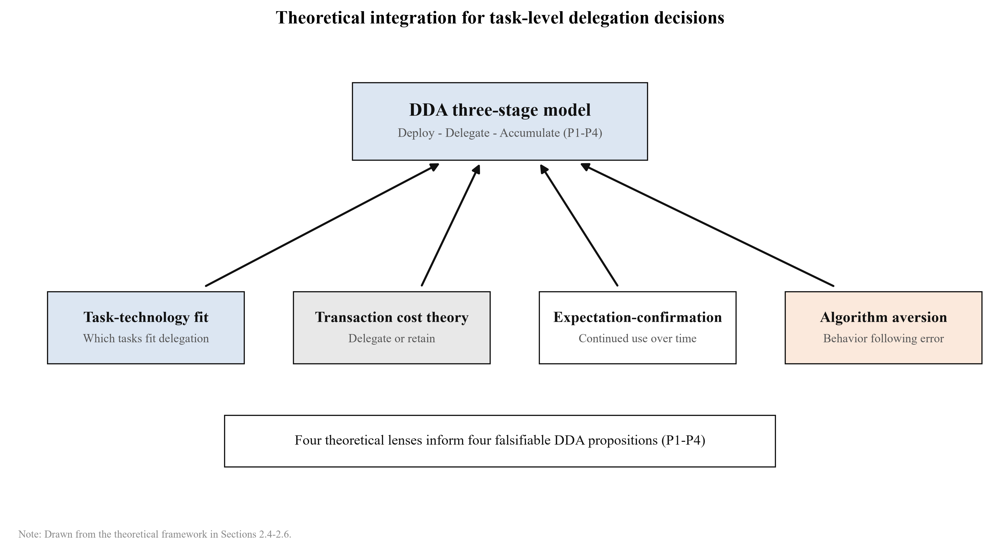

*Figure 3. Theoretical integration of task fit, transaction costs, trust calibration, and continuance.*

| Established literature | What it explains well | Gap addressed here |
| --- | --- | --- |
| Multi-agent architecture | Role specialization, coordination, tools, verification | Deployment effort and user allocation of authority |
| Technology acceptance and continuance | System-level adoption and post-adoption intention | Recurrent stage-level delegation within continued use |
| Task-technology fit | Performance conditional on task requirements | Dynamic movement of the delegation boundary after experience |
| Trust and algorithm aversion | Appropriate reliance and response to error | Longitudinal withdrawal and recalibration in personal workflows |
| Agent memory | Storage, retrieval, and personalization mechanisms | Association between accumulated personal context and continuance |

### 2.6 The Deploy-Delegate-Accumulate model

The DDA model represents personal-agent use as three connected processes.

- **Deploy.** A user crosses the initial access threshold by establishing an agent entry point, collaboration rules, and memory structure. Feasibility is observed through completion, elapsed time, assistance, and failure points.
- **Delegate.** The user assigns authority at the workflow-stage level. Each allocation depends on task-technology fit, trust informed by experience, interaction cost, and consequences of error.
- **Accumulate.** Use produces persistent user-specific context. Memory may reduce repeated explanation and improve personalization, while also increasing switching cost. Successful and unsuccessful experience feeds back into later delegation decisions.

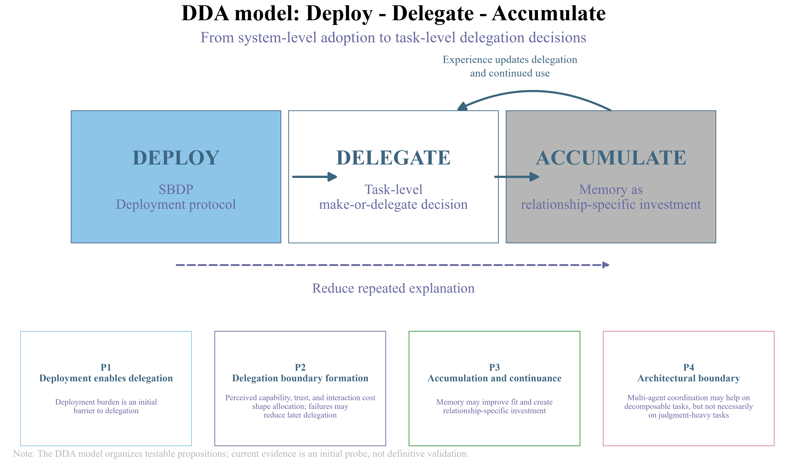

*Figure 4. Deploy-Delegate-Accumulate model and its four empirical propositions.*

The model is a proposed process account. The studies provide different kinds of evidence for its components, but no single result validates the full causal sequence.

## 3. Method

### 3.1 Design-science strategy and triangulation

The project follows the six design-science activities described by Peffers et al. (2007): problem identification, objective definition, artifact design and development, demonstration, evaluation, and communication. The SBDP guide and personal-agent configuration are treated as artifacts developed in response to an access and coordination problem (Hevner et al., 2004). Evaluation combines observed deployment, a post-workshop survey, coded usage events with memory linkage, and a within-participant comparative pilot.

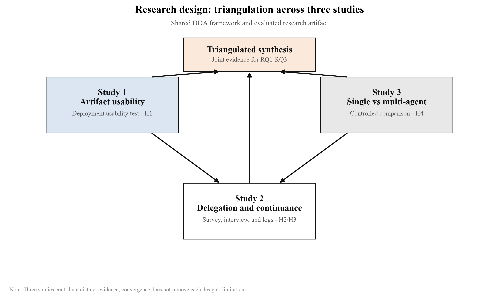

*Figure 5. Triangulation across deployment usability, field-use evidence, and controlled comparison.*

The evidence sources answer different questions and are not interchangeable. Deployment observations evaluate operational use of the artifact. Survey responses describe perceptions and selected delegation stages. Event records provide behavioral and temporal detail. The experiment provides controlled within-person comparisons but limited statistical resolution. Convergence increases plausibility; it does not erase the design limitations of each source.

### 3.2 Study 1: deployment usability

Five people who had not attended the workshop and reported no programming background attempted deployment using the guide as their only instructional material. The SBDP artifact converts specialist configuration knowledge into six document-guided stages: two-round information collection, creation of an entry file, creation of the memory directory, initialization of memory files, confirmation of completion, and continuing use.

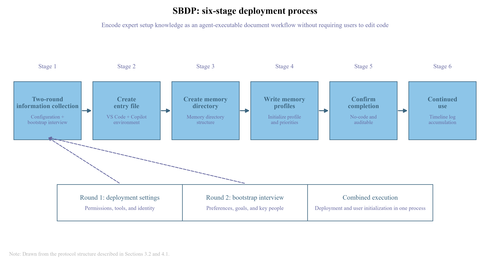

*Figure 6. Six-stage SBDP workflow used in Study 1.*

An observer recorded completion, elapsed time, assistance points, and failure. Participants completed the System Usability Scale immediately after the attempt (Brooke, 1996). The operational target was completion by at least four of five participants, with successful attempts near 30 minutes. SUS = 68 was retained as a common visual reference rather than a universal pass/fail threshold. The study did not observe a manual-configuration control group; claims about time savings relative to conventional setup are therefore outside the evidence.

### 3.3 Study 2: survey, event coding, and memory linkage

The anonymous survey measured current use, perceived usefulness, perceived ease of use, perceived trust, perceived risk, continuance intention, delegated workflow stages, reasons for withdrawal, perceived memory, and two quality-control items. Perceptual constructs used seven-point agreement responses. Delegated stages and withdrawal reasons used multi-select binary indicators. Thirty responses were received. One failed the instructed-response item and was excluded from survey-derived analyses, leaving 29 valid responses.

Internal consistency was estimated using Cronbach's alpha. H2 was tested using Cochran's Q across seven related binary indicators, followed by exact McNemar contrasts with Holm adjustment. Wilson intervals describe stage-level proportions.

The event dataset contains 327 delegation events from 13 pseudonymous users. Each event records date, sequence, workflow stage, outcome, failure reason, iterations, and error exposure. Sixty-five events were independently double-coded. Cohen's kappa was calculated for workflow stage, outcome, failure reason, and error exposure.

H3a uses the first failed or partially successful event within each user's workflow stage as the index event. Events in the same stage were counted during symmetric 14-day windows before and after the index date, excluding the index date itself. A stage entered the analysis only if at least one pre-index event existed. Because one user could contribute several stages, the primary analysis averaged eligible stage rates within user and then applied an exact paired Wilcoxon signed-rank test across 12 users. The user-stage analysis is retained as a sensitivity check, not as independent-person inference.

Thirteen survey responses were linked to memory indicators through pseudonymous codes. Timeline length and the number of memory updates were correlated with the respondent's mean continuance-intention score using Spearman's rho. Percentile bootstrap intervals used 10,000 resamples and a fixed random seed. These are cross-sectional associations and do not establish whether memory caused continuance.

### 3.4 Study 3: comparative experiment

Four participants each completed three tasks under single-agent and multi-agent conditions. Task A required information retrieval and organization; Task B required cleaning and summarizing a small simulated dataset; Task C required an integrative review from supplied prose materials. Condition and task order were counterbalanced. Outcomes were total time, human intervention count, human intervention time, and blind-rated output quality. Two raters scored relevance, accuracy, structure, and completeness on five-point scales.

Condition means and SDs were calculated within task. Exact two-sided Wilcoxon tests compared paired observations. Matched-pairs rank-biserial correlations were oriented so that positive values favor the multi-agent condition. With four non-zero paired differences in one direction, the smallest attainable exact two-sided p-value is .125. The experiment is therefore interpreted through direction, magnitude, and consistency rather than a significance threshold. No non-inferiority margin was specified.

### 3.5 Ethics and data governance

Participation was voluntary and governed by informed consent. Link codes and study IDs were pseudonymous. The original consent terms stated that participant-level data would not be distributed externally. Public repository outputs are therefore restricted to aggregate, non-disclosive tables and figures unless renewed consent and institutional authorization permit a broader release.

The researcher remains responsible for the study design, source data, analytical specifications, interpretation, and final claims. The repository documents evidence boundaries and preserves machine-readable aggregate outputs.

## 4. Results

### 4.1 Study 1: deployment feasibility and SBDP

Four of five participants completed deployment, meeting the operational 80% target. Successful attempts took 26, 27, 31, and 34 minutes; the mean was 29.5 minutes (SD = 3.7). The unsuccessful attempt ended at 42 minutes after four assistance points. SUS averaged 66.2 across all five attempts and 72.25 among completers. These values describe the observed artifact and sample. They do not provide a controlled estimate of time saved relative to manual configuration.

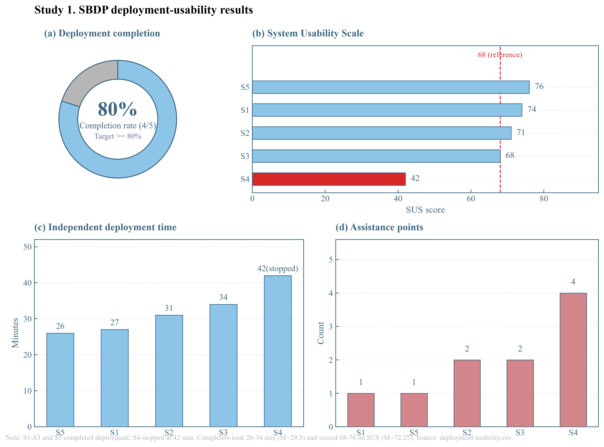

*Figure 7. Completion, SUS, elapsed time, and assistance points in the five deployment attempts.*

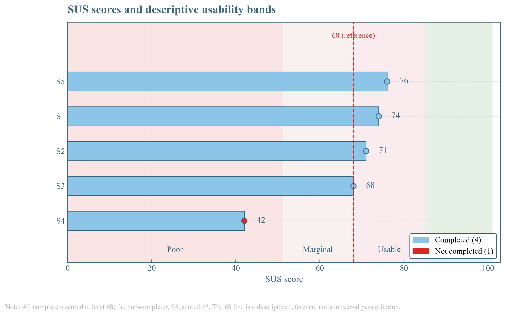

*Figure 8. Participant-level SUS scores. The value 68 is a descriptive reference rather than a universal pass criterion.*

The result supports the bounded feasibility expectation in H1: four participants completed deployment near the intended time range and all completers scored at least 68 on SUS. The non-completion is analytically important. It shows that document-guided deployment still depends on tool state, permissions, path handling, and the clarity of executable instructions.

### 4.2 Study 2: delegation boundaries, withdrawal, and continued use

#### 4.2.1 Current use and the delegation boundary

The valid survey included current users, respondents who had used the system but stopped, and respondents who had completed setup without establishing continued use. This variation is retained rather than treating workshop participation as equivalent to adoption.

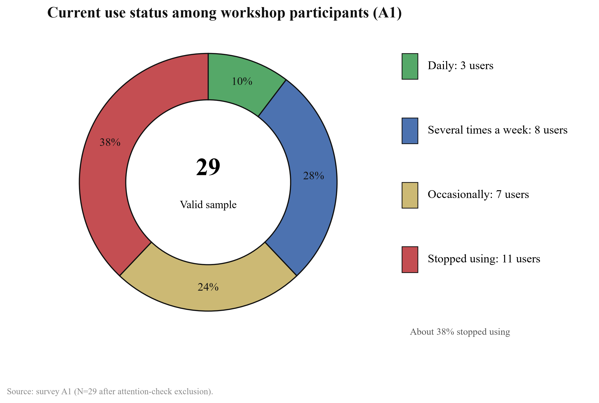

*Figure 9. Distribution of current-use status among 29 valid survey responses.*

Delegation varied substantially across the seven stages, Cochran's Q(6) = 54.23, p < .001. Content generation was selected by 72.4% of valid respondents and information retrieval by 65.5%. Information organization followed at 48.3%. Analysis and reasoning (27.6%) and operational execution (20.7%) were less frequently delegated. Judgment and decision (13.8%) and problem definition (6.9%) were least frequently selected.

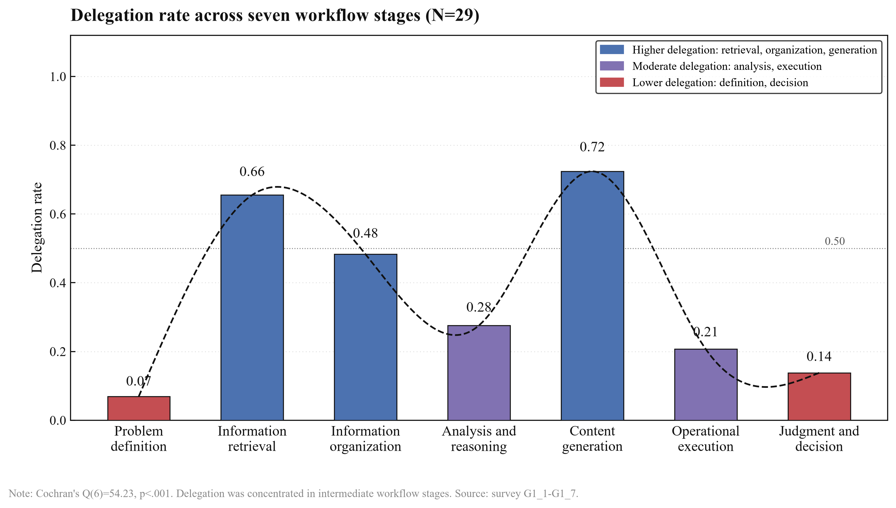

*Figure 10. Delegation rates across seven related workflow stages, N = 29.*

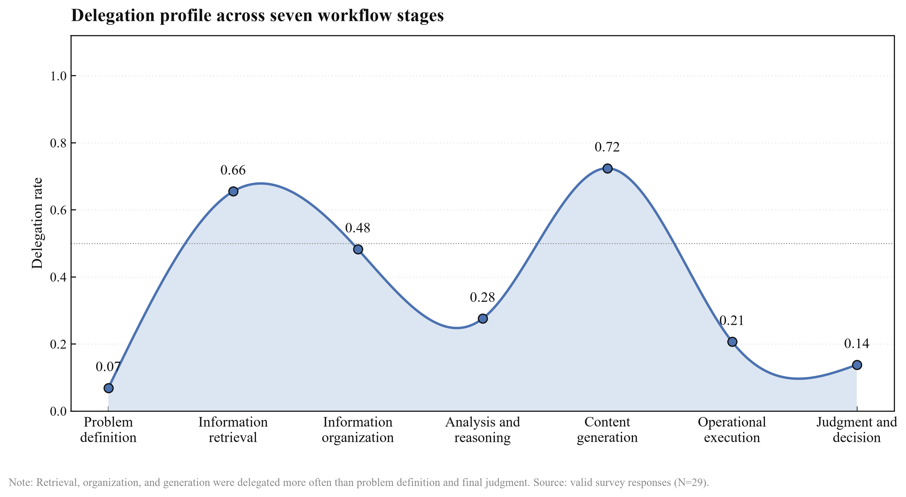

*Figure 11. The observed middle-high, boundary-low delegation profile.*

The distribution is consistent with a *human at the boundaries* pattern: users retained greater control over defining the problem and making the final decision while delegating more work in intermediate production stages. The three most delegated stages shared three structural features: outputs could be checked quickly, errors were comparatively reversible, and the work encoded less of the user's goals and values. Low-delegation stages placed greater weight on goal formation, responsibility, and value-laden judgment.

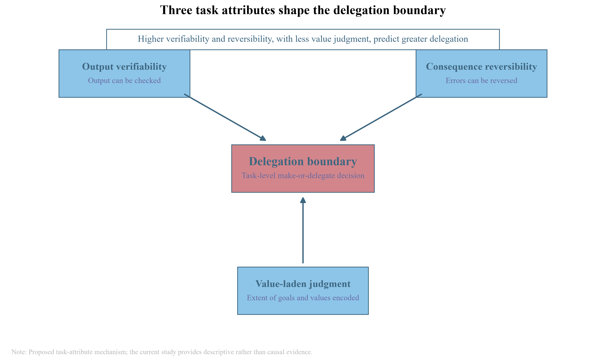

*Figure 12. Output verifiability, consequence reversibility, and value encoding as task-level correlates of the delegation boundary.*

The pattern should not be treated as universal. It reflects one workshop population, one artifact, and the tasks encountered during the observation period.

#### 4.2.2 Delegation-withdrawal event flow

The 327 coded events reveal how local allocation decisions developed over time. Successful events predominated, but partial success, withdrawal, and failure appeared across the workflow. The event sequence also shows that a low-frequency failure can matter beyond its numerical share when it changes subsequent behavior.

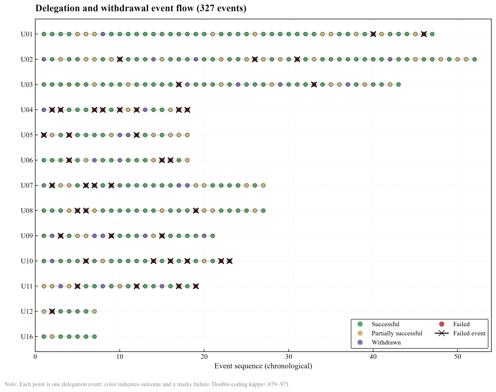

*Figure 13. Chronological sequence of 327 coded delegation events; color indicates outcome and x marks failure.*

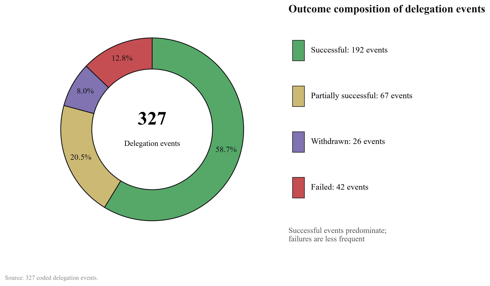

*Figure 14. Aggregate outcome composition across the event dataset.*

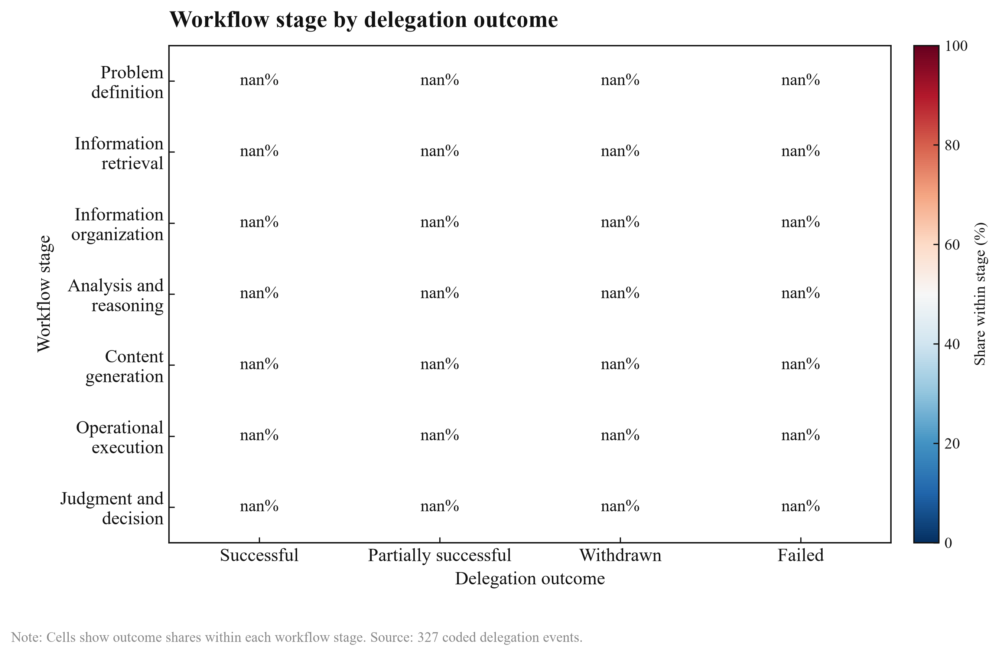

*Figure 15. Within-stage outcome shares, preventing frequently used stages from dominating the comparison.*

The coded failure reasons show that withdrawal was not solely a response to factual error. Insufficient capability and unreliable output appeared alongside a failure to save time, privacy concerns, and personal preference. This supports an interaction-cost interpretation: technically possible delegation may still be unattractive if specifying, supervising, or checking the work is too burdensome.

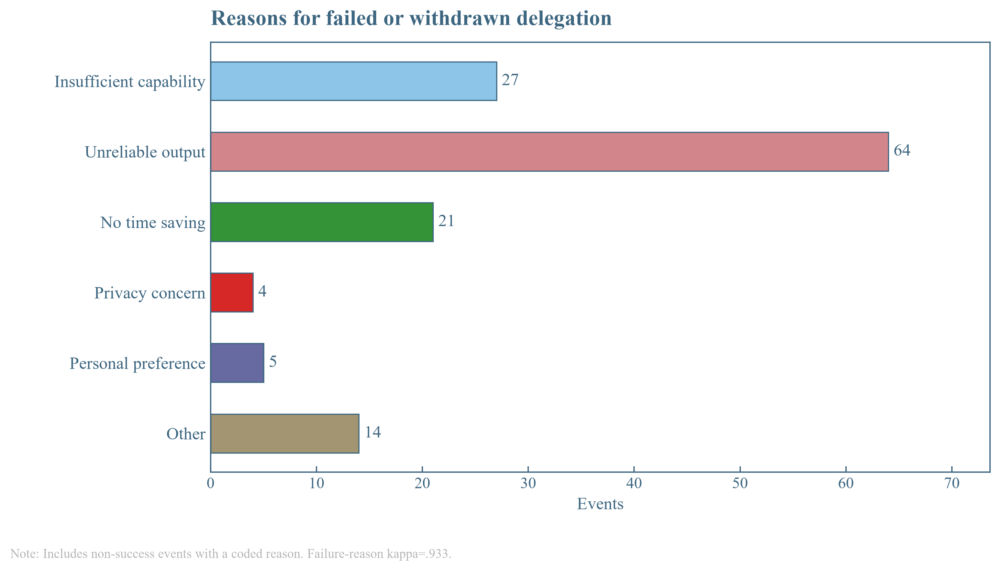

*Figure 16. Distribution of coded reasons among non-success events with a recorded reason.*

Error exposure also varied. Some problems were detected and corrected during the interaction; others were found only later. The observational data are compatible with the view that promptly visible and correctable errors are less damaging to continued reliance, but they do not establish a causal effect of exposure timing.

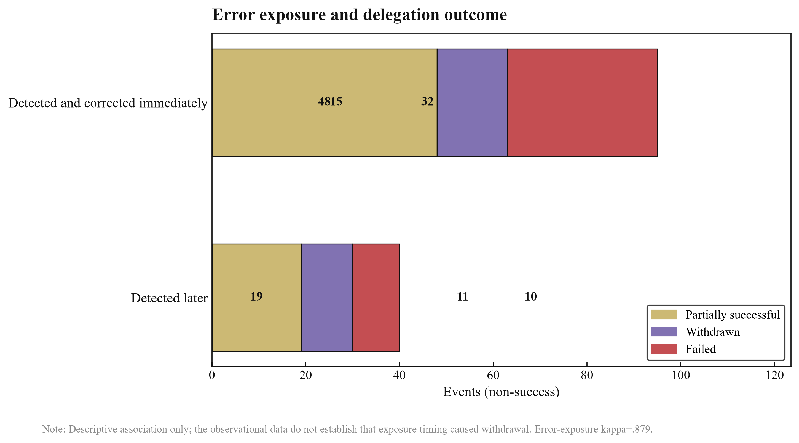

*Figure 17. Descriptive association between error-exposure timing and delegation outcome.*

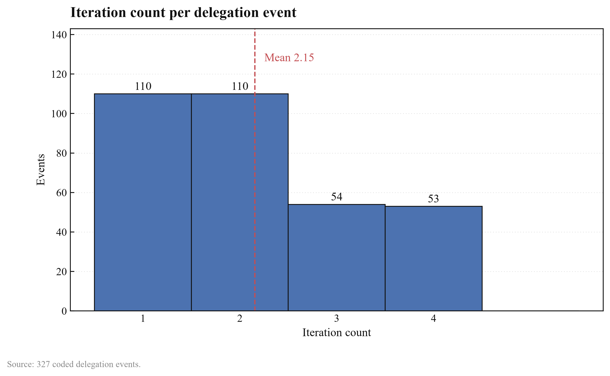

*Figure 18. Distribution of iteration counts, showing the correction burden attached to individual events.*

Survey respondents most often selected insufficient capability (55.2%) and no time saving (51.7%) as reasons for taking back delegated work. Unreliable output was selected by 37.9%, preference for personal completion by 24.1%, and privacy concern by 20.7%. Multiple selections were allowed.

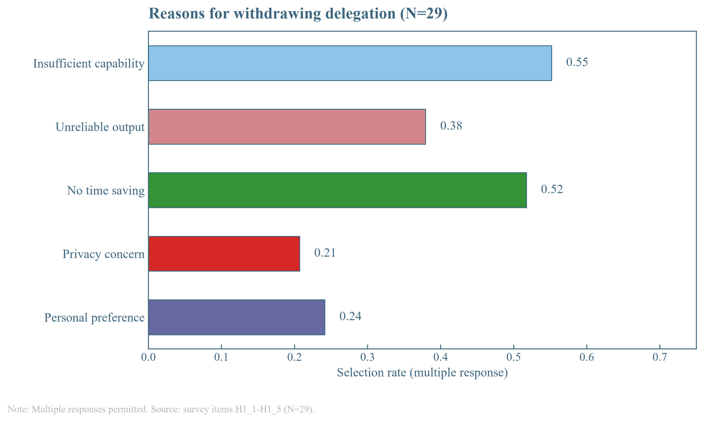

*Figure 19. Multiple-response withdrawal reasons among 29 valid respondents.*

Two recurrent sequences were observed. In a *trial-error-withdrawal* sequence, a user first delegated a stage, encountered an unsuccessful outcome, and subsequently reduced or ceased delegation in that stage. In an *accumulation-continuance* sequence, repeated successful use coincided with expanding personal memory and more regular system use. These sequences motivate the tests below but do not, by themselves, identify causal mechanisms.

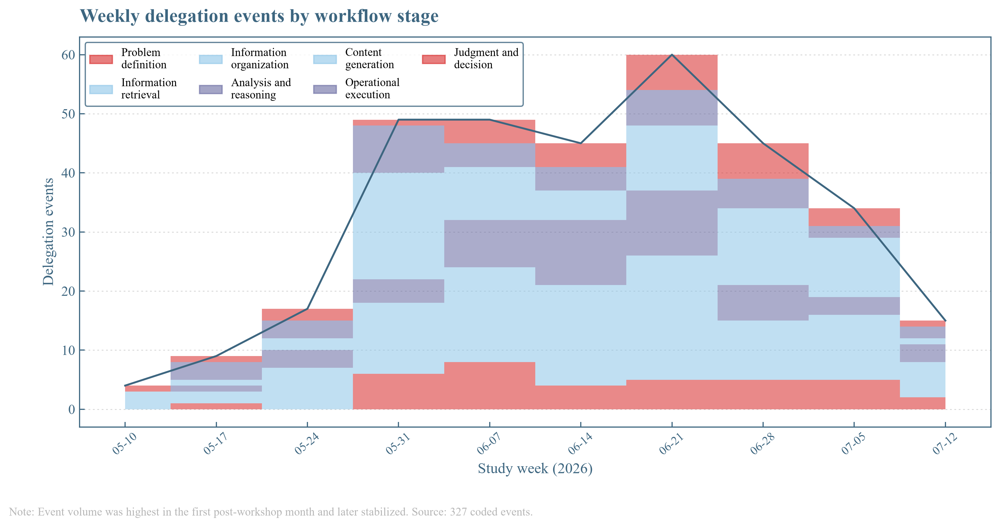

*Figure 20. Weekly event counts across the observation period.*

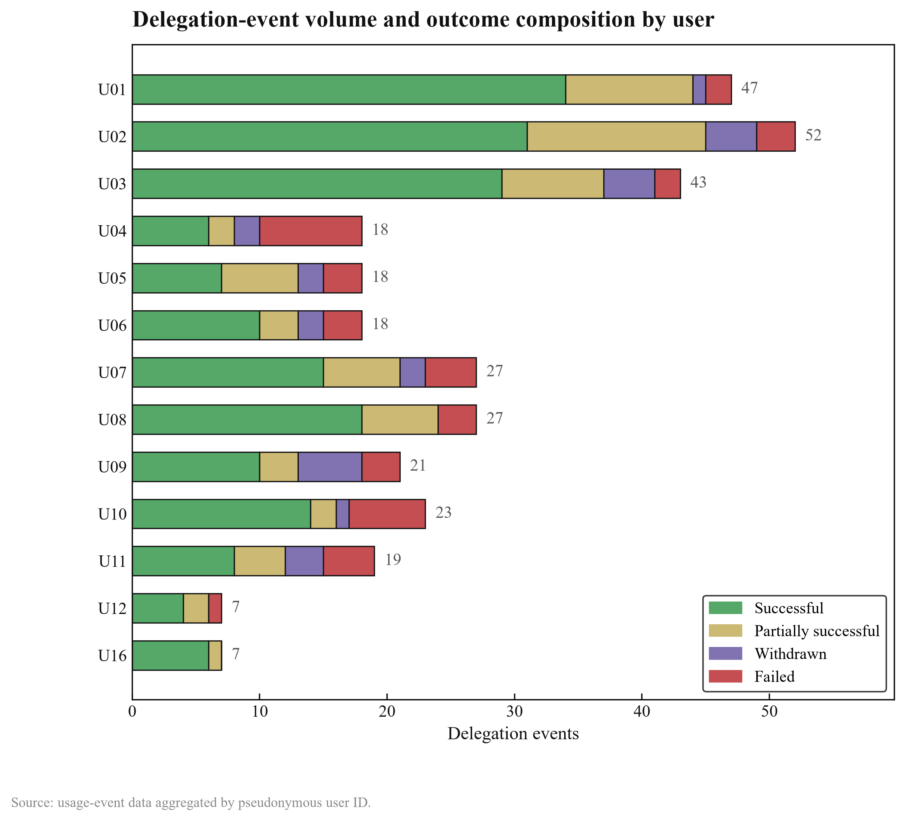

*Figure 21. Outcome composition for each pseudonymous user, retaining heterogeneity hidden by the aggregate distribution.*

#### 4.2.3 Hypothesis tests

After aggregating eligible stages within each user, the mean daily delegation rate declined from .122 in the 14 days before the index event to .051 in the 14 days after it. The exact Wilcoxon test produced W = 1.5, p = .0015, n = 12. The event pattern is strong within this sample, but the causal interpretation remains open. The index event may have caused the user to revise trust, yet the decline could also reflect changing task opportunities, completion of a burst of work, or other time-varying factors.

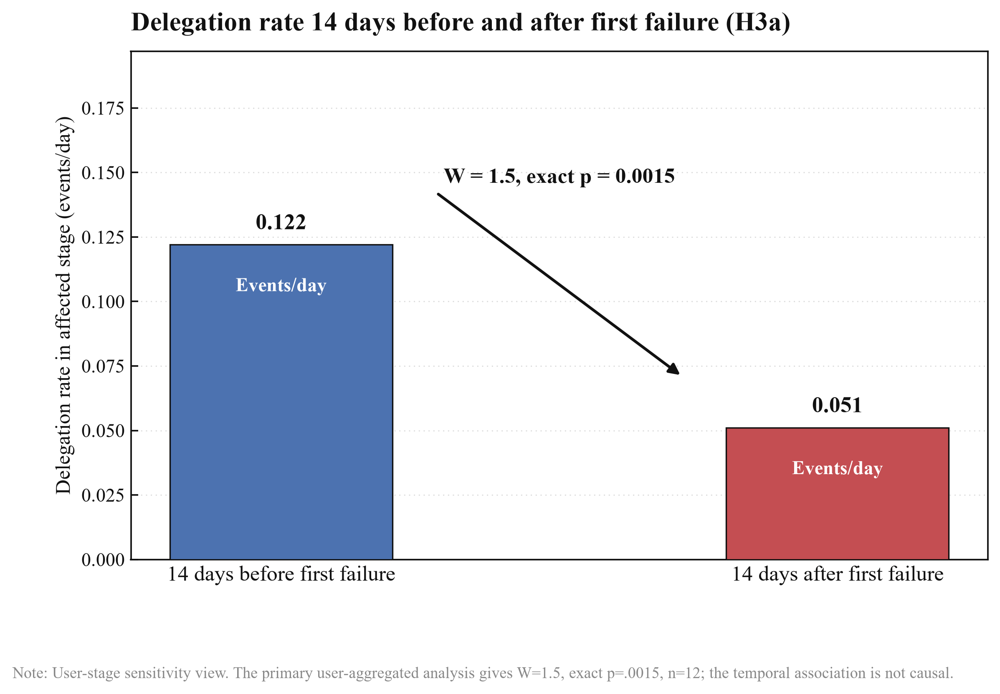

*Figure 22. Fourteen-day delegation rates before and after the first failed or partially successful event in an affected stage. The primary inferential unit is the user.*

Timeline length was positively associated with continuance intention, rho = .850, p < .001, n = 13. Memory-update frequency showed a similar association, rho = .781, p = .002. These relationships are consistent with the accumulation component of DDA, but they do not distinguish improved personalization from switching costs, general engagement, tenure, or self-selection.

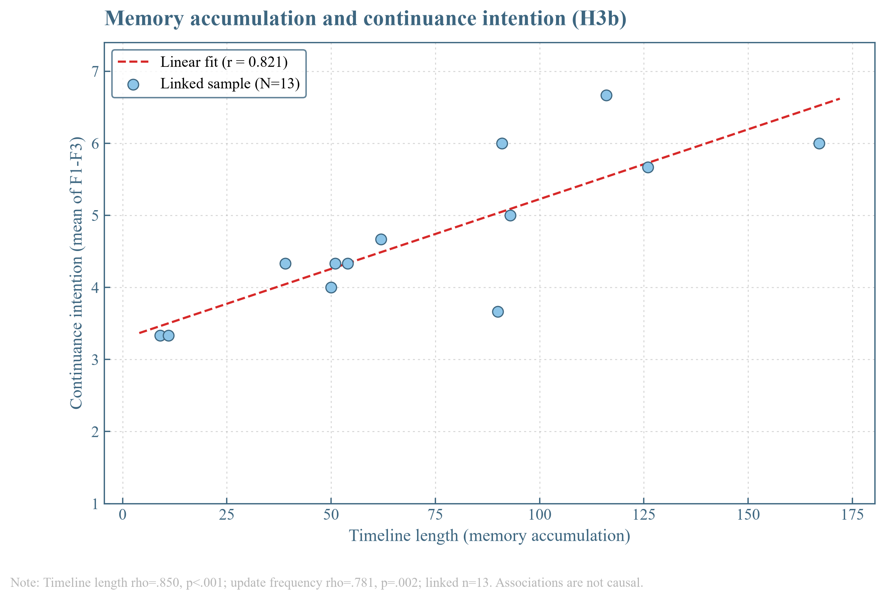

*Figure 23. Associations of timeline length and memory-update frequency with continuance intention in the linked sample.*

#### 4.2.4 Measurement and coding reliability

Internal consistency was acceptable in this sample for perceived usefulness (alpha = .871), perceived ease of use (.778), perceived trust (.815), continuance intention (.879), and perceived memory (.814). Perceived risk had low internal consistency (alpha = .403) and is not interpreted as a coherent composite. In the 65 double-coded event records, Cohen's kappa was .943 for workflow stage, .971 for outcome, .933 for failure reason, and .879 for error exposure.

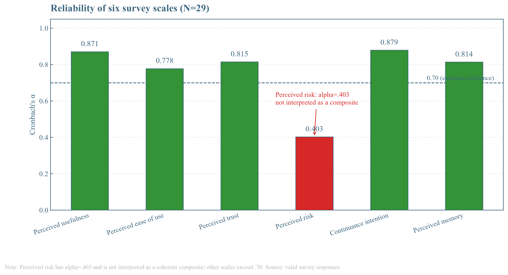

*Figure 24. Cronbach's alpha for the six survey constructs. Perceived risk is retained item-wise rather than interpreted as a reliable scale.*

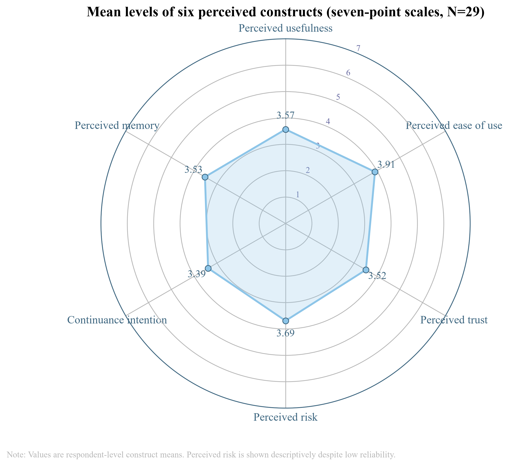

*Figure 25. Descriptive means of the six perceived constructs; the risk score is displayed descriptively despite its low reliability.*

### 4.3 Study 3: single-agent and multi-agent comparison

For Task A, mean total time was 29.75 minutes in the single-agent condition and 16.25 minutes in the multi-agent condition. For Task B, the corresponding means were 26.00 and 20.50 minutes. All four paired differences favored the multi-agent condition for both tasks, but exact two-sided p = .125 in each case. Task C showed little difference: 23.00 versus 24.00 minutes, p = .875.

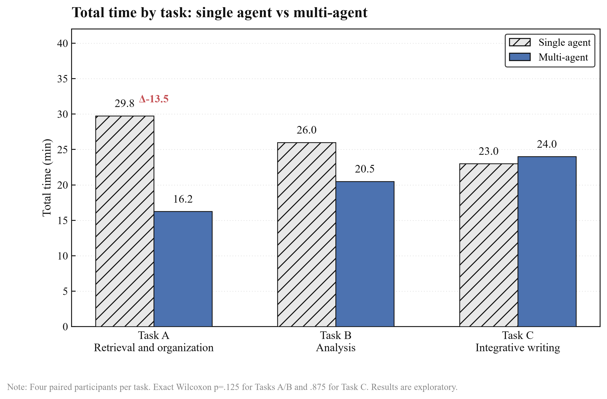

*Figure 26. Mean total completion time by task and condition.*

Intervention counts followed the same task-contingent pattern. Task A decreased from 14.50 to 7.00 and Task B from 10.25 to 6.25 under the multi-agent condition. Task C increased slightly from 8.75 to 9.50.

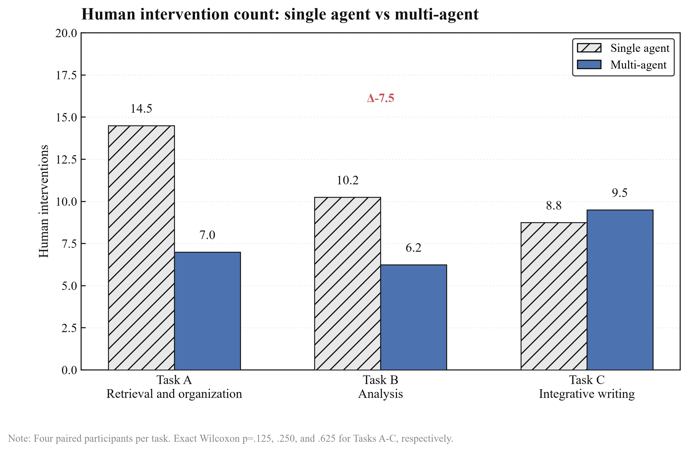

*Figure 27. Mean number of human interventions by task and condition.*

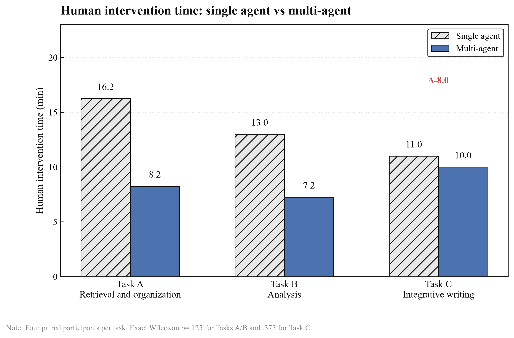

*Figure 28. Mean human-intervention time by task and condition.*

Mean blind-rated quality was slightly lower for the multi-agent condition on Task A (3.22 versus 3.38), higher on Task B (4.31 versus 3.50), and slightly higher on Task C (4.00 versus 3.78). The absolute-agreement single-rating ICC across the two raters' overall output scores was .799. No quality comparison was statistically significant, but non-significance with four pairs cannot establish equivalence or non-inferiority.

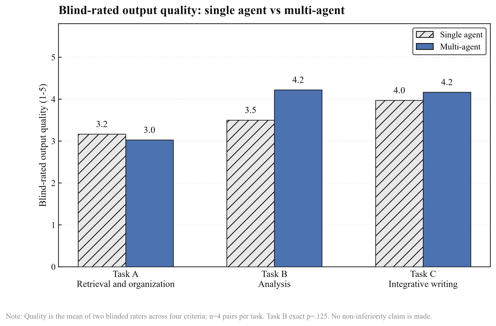

*Figure 29. Mean blind-rated output quality across tasks and conditions.*

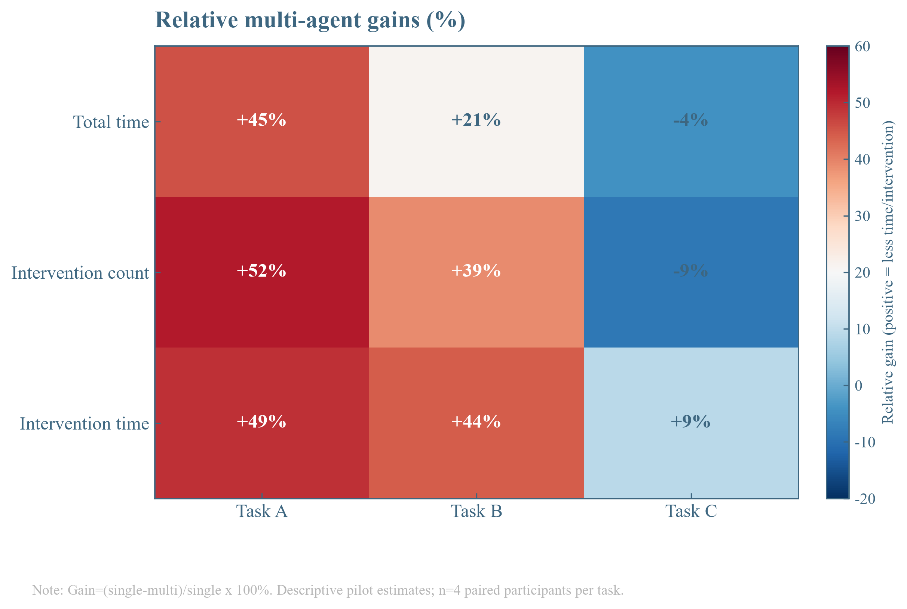

*Figure 30. Relative differences in time and intervention burden. Positive values indicate an advantage for the multi-agent condition under the displayed orientation.*

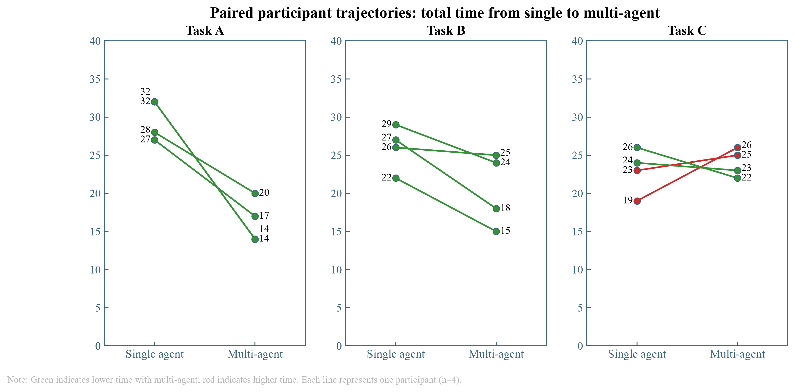

*Figure 31. Participant-level total-time trajectories from single-agent to multi-agent conditions.*

For Tasks A and B, the direction and magnitude of time and intervention differences are consistent with H4's mechanism expectation: decomposable, multi-stage tasks may benefit from role separation and checking. Task C shows that the advantage does not automatically extend to a more subjective writing task. Because each task has four paired observations, the evidence is exploratory rather than confirmatory.

## 5. Discussion

### 5.1 Answers to the research questions

**RQ1.** The SBDP artifact enabled four of five non-technical participants to complete deployment, with successful attempts averaging 29.5 minutes and a mean completer SUS score of 72.25. This supports operational feasibility in the observed setting. It does not establish superiority over manual configuration.

**RQ2.** Delegation was stage-specific rather than system-wide. Users most often delegated retrieval, organization, and generation while retaining problem definition and final judgment. Delegation decreased after unsuccessful events in affected stages, and memory indicators were positively associated with continuance intention. These results support a process account of recurrent allocation and recalibration, while causal mechanisms remain unproven.

**RQ3.** Multi-agent workflows showed lower time and intervention burden on the decomposable Tasks A and B, but not on Task C. The exact tests were resolution-limited by n = 4 pairs per task. The pilot therefore identifies a task-contingent pattern for further testing, not a general performance verdict.

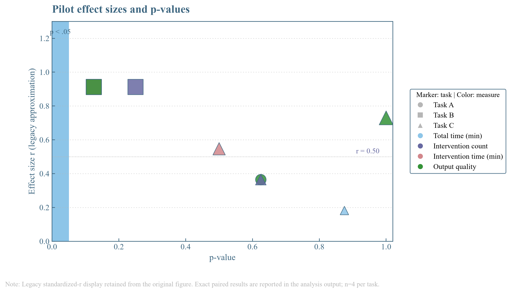

*Figure 32. Effect-size directions and exact p-values. Large directional effects can coexist with non-significant tests in a four-pair pilot.*

### 5.2 Dialogue with prior literature

The findings refine adoption research by moving from system-level acceptance to stage-level recurrent decisions. Usefulness and ease of use remain relevant, but the behavioral object becomes a stream of local allocations. A person can continue using an agent while retaining judgment, narrowing delegation after failure, or moving work to a different stage. Task-technology fit provides the stage-level criterion; transaction cost reasoning explains why a technically capable output may still be inefficient to obtain.

The decline after an unsuccessful event is compatible with algorithm aversion, but *aversion* may overstate the irrationality of the response. If a failure reveals a genuine capability limit or a high verification burden, reducing delegation is a calibrated decision. The design objective should not be to maximize delegation. It should be to help users locate where delegation is reliable, reversible, and worth the interaction cost.

The memory associations fit the proposed accumulation process. Users with more extensive timelines and more updates reported stronger continuance intentions. The relationship may reflect personalization, reduced repeated explanation, or investment that makes switching costly. These mechanisms have different normative implications and require separate tests.

### 5.3 Scope and boundary conditions of DDA

DDA is most applicable to settings with recurrent tasks, persistent user-specific context, and meaningful opportunities to revise delegation. It is less informative for one-off prompt use, fully automated back-office processes with no continuing human allocation decision, or systems whose memory is neither persistent nor user-specific. The model also assumes that workflow stages can be identified at a useful level of granularity. In tightly coupled creative activity, stage boundaries may be ambiguous.

Deployment, delegation, and accumulation need not proceed linearly. A user may return to deployment after a tool or model change, delete or migrate memory, or broaden one stage while withdrawing another. The arrows in DDA therefore represent a feedback process rather than a maturity ladder.

### 5.4 Implications for design and research

For system designers, the evidence favors inspectable configuration, explicit division of roles, local verification, reversible outputs, and portable memory. Verification should preserve correction authority rather than merely add another model response. Memory should be auditable and exportable so that continuance does not depend on hidden lock-in.

For users, the practical strategy is calibrated delegation: retain problem definition and consequential judgment, delegate verifiable and reversible intermediate work, and revise the boundary using observed performance and checking cost. For organizations, governance should be task-sensitive. Policies that classify an entire model or platform as either allowed or prohibited can miss meaningful variation in reversibility, data sensitivity, and accountability across stages.

For researchers, deployment cost should be measured rather than treated as a preliminary inconvenience. The next comparative study should separate role orchestration, independent verification, and memory through incremental or factorial conditions; record model, tool, prompt, latency, token, and monetary-cost metadata; and preregister inferential specifications and, where relevant, non-inferiority margins.

## 6. Conclusion, limitations, and future research

### 6.1 Conclusion

Personal multi-agent adoption is better understood as a process of calibrated delegation than as a single decision to use AI. Users must cross a deployment threshold, allocate authority across heterogeneous workflow stages, update those allocations after experience, and decide whether accumulated context justifies continued use. The present evidence shows that document-guided deployment was feasible for four of five observed participants, delegation differed strongly by stage, delegation declined after unsuccessful events, and memory indicators were associated with continuance intention. A four-person comparative pilot produced task-contingent effect directions but no confirmatory performance evidence.

The DDA model provides a common vocabulary for these observations: deploy, delegate, and accumulate. Its present value lies in organizing falsifiable questions and transparent evidence. The research contributes a process model, an evaluated deployment artifact, and a mixed-method evidence structure connecting reported preferences with observed events and an exploratory controlled comparison.

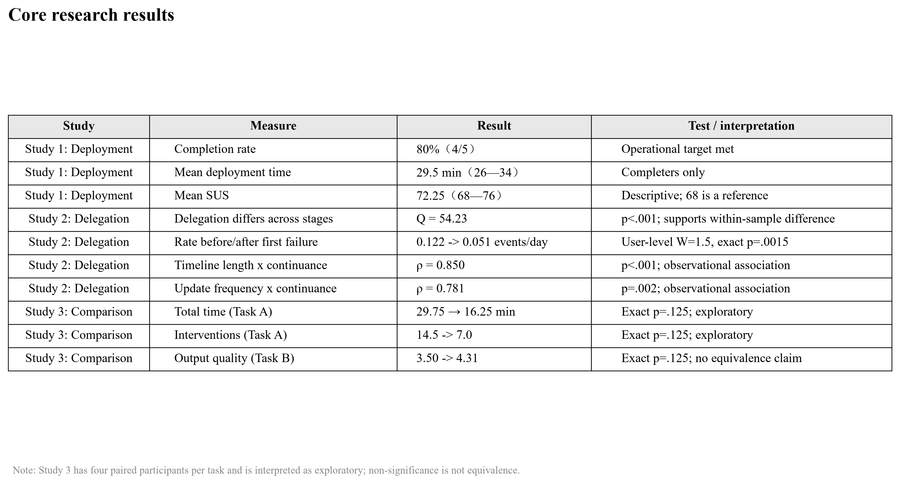

*Figure 33. Summary of the principal results and their evidentiary interpretation.*

### 6.2 Limitations

First, all participant samples are small and drawn from a single institutional and workshop context. Estimates have limited precision and cannot be generalized to other populations or organizations without replication.

Second, the survey is cross-sectional and uses self-report. Common method variance, selection into continued use, and retrospective interpretation may influence associations. The perceived-risk items have poor internal consistency in this sample and should be redesigned before further use.

Third, the event study is observational. A temporal change after failure does not identify a causal effect. Event opportunities may vary over time, and platform differences may affect how activity was recorded.

Fourth, the memory linkage uses simple file counts and update frequency. These indicators do not measure semantic quality, retrieval accuracy, privacy risk, or the actual use of a memory in agent output.

Fifth, the comparative experiment is underpowered and bundles several treatment features. The task stimulus packets are not released in the public repository, preventing full independent reproduction of those inputs.

Sixth, agent systems change rapidly. Model versions, product interfaces, tool permissions, and context-management behavior may move the capability boundary after data collection. Results should be interpreted in their 2026 collection context.

### 6.3 Future research

Future work should conduct larger multisite deployment trials with a conventional tutorial or assisted-setup comparator; preregister longitudinal tests that model task opportunity and repeated observations; manipulate failure visibility and correction authority; distinguish memory-enabled personalization from non-portable switching costs; and evaluate orchestration, verification, and memory as separable treatment components. Research should also measure economic cost, latency, privacy exposure, portability, and user understanding alongside task performance.

## References

Anthropic. (2024). *Building effective agents*. https://www.anthropic.com/research/building-effective-agents

Bhattacherjee, A. (2001). Understanding information systems continuance: An expectation-confirmation model. *MIS Quarterly, 25*(3), 351-370. https://doi.org/10.2307/3250921

Brooke, J. (1996). SUS: A “quick and dirty” usability scale. In P. W. Jordan, B. Thomas, B. A. Weerdmeester, & I. L. McClelland (Eds.), *Usability evaluation in industry* (pp. 189-194). Taylor & Francis.

Brynjolfsson, E., Li, D., & Raymond, L. R. (2025). Generative AI at work. *The Quarterly Journal of Economics, 140*(2), 889-942. https://doi.org/10.1093/qje/qjae044

Davis, F. D. (1989). Perceived usefulness, perceived ease of use, and user acceptance of information technology. *MIS Quarterly, 13*(3), 319-340. https://doi.org/10.2307/249008

DeSanctis, G., & Poole, M. S. (1994). Capturing the complexity in advanced technology use: Adaptive structuration theory. *Organization Science, 5*(2), 121-147. https://doi.org/10.1287/orsc.5.2.121

Dell'Acqua, F., McFowland, E., III, Mollick, E. R., et al. (2026). Navigating the jagged technological frontier: Field experimental evidence of the effects of AI on knowledge worker productivity and quality. *Organization Science, 37*(2), 403-423. https://doi.org/10.1287/orsc.2025.21838

Dietvorst, B. J., Simmons, J. P., & Massey, C. (2015). Algorithm aversion: People erroneously avoid algorithms after seeing them err. *Journal of Experimental Psychology: General, 144*(1), 114-126. https://doi.org/10.1037/xge0000033

Goodhue, D. L., & Thompson, R. L. (1995). Task-technology fit and individual performance. *MIS Quarterly, 19*(2), 213-236. https://doi.org/10.2307/249689

Gor, M., Sung, Y. Y., Hou, Y., et al. (2026). AI, take the wheel: What drives delegation and trust in human-computer cooperative question answering? [Preprint]. *arXiv*. https://arxiv.org/abs/2605.28255

Hevner, A. R., March, S. T., Park, J., & Ram, S. (2004). Design science in information systems research. *MIS Quarterly, 28*(1), 75-105. https://doi.org/10.2307/25148625

Hong, S., Zhuge, M., Chen, J., et al. (2024). MetaGPT: Meta programming for a multi-agent collaborative framework. *International Conference on Learning Representations*. https://openreview.net/forum?id=VtmBAGCN7o

Lee, J. D., & See, K. A. (2004). Trust in automation: Designing for appropriate reliance. *Human Factors, 46*(1), 50-80. https://doi.org/10.1518/hfes.46.1.50_30392

Lewis, P., Perez, E., Piktus, A., et al. (2020). Retrieval-augmented generation for knowledge-intensive NLP tasks. *Advances in Neural Information Processing Systems, 33*, 9459-9474. https://proceedings.neurips.cc/paper/2020/hash/6b493230205f780e1bc26945df7481e5-Abstract.html

Li, G., Hammoud, H. A. K., Itani, H., Khizbullin, D., & Ghanem, B. (2023). CAMEL: Communicative agents for “mind” exploration of large language model society. *Advances in Neural Information Processing Systems, 36*. https://doi.org/10.52202/075280-2264

Madaan, A., Tandon, N., Gupta, P., et al. (2023). Self-Refine: Iterative refinement with self-feedback. *Advances in Neural Information Processing Systems, 36*. https://proceedings.neurips.cc/paper_files/paper/2023/hash/91edff07232fb1b55a505a9e9f6c0ff3-Abstract-Conference.html

Nalisnick, E., Zhang, C., Qian, S., & Wang, Y. (2026). Human-AI teaming through the lens of calibration [Preprint]. *arXiv*. https://arxiv.org/abs/2606.10906

Noy, S., & Zhang, W. (2023). Experimental evidence on the productivity effects of generative artificial intelligence. *Science, 381*(6654), 187-192. https://doi.org/10.1126/science.adh2586

Packer, C., Fang, V., Patil, S. G., Lin, K., Wooders, S., & Gonzalez, J. E. (2023). MemGPT: Towards LLMs as operating systems [Preprint]. *arXiv*. https://doi.org/10.48550/arXiv.2310.08560

Park, J. S., O'Brien, J., Cai, C. J., Morris, M. R., Liang, P., & Bernstein, M. S. (2023). Generative agents: Interactive simulacra of human behavior. In *Proceedings of the 36th Annual ACM Symposium on User Interface Software and Technology*. https://doi.org/10.1145/3586183.3606763

Orlikowski, W. J. (2000). Using technology and constituting structures: A practice lens for studying technology in organizations. *Organization Science, 11*(4), 404-428. https://doi.org/10.1287/orsc.11.4.404.14600

Peffers, K., Tuunanen, T., Rothenberger, M. A., & Chatterjee, S. (2007). A design science research methodology for information systems research. *Journal of Management Information Systems, 24*(3), 45-77. https://doi.org/10.2753/MIS0742-1222240302

Shinn, N., Cassano, F., Gopinath, A., Narasimhan, K., & Yao, S. (2023). Reflexion: Language agents with verbal reinforcement learning. *Advances in Neural Information Processing Systems, 36*. https://proceedings.neurips.cc/paper_files/paper/2023/hash/1b44b878bb782e6954cd888628510e90-Abstract-Conference.html

Skitka, L. J., Mosier, K. L., & Burdick, M. (1999). Does automation bias decision-making? *International Journal of Human-Computer Studies, 51*(5), 991-1006. https://doi.org/10.1006/ijhc.1999.0252

Venkatesh, V., Morris, M. G., Davis, G. B., & Davis, F. D. (2003). User acceptance of information technology: Toward a unified view. *MIS Quarterly, 27*(3), 425-478. https://doi.org/10.2307/30036540

Venkatesh, V., Thong, J. Y. L., & Xu, X. (2012). Consumer acceptance and use of information technology: Extending the unified theory of acceptance and use of technology. *MIS Quarterly, 36*(1), 157-178. https://doi.org/10.2307/41410412

Williamson, O. E. (1985). *The economic institutions of capitalism*. Free Press.

Wood, R. E. (1986). Task complexity: Definition of the construct. *Organizational Behavior and Human Decision Processes, 37*(1), 60-82. https://doi.org/10.1016/0749-5978(86)90044-0

Wu, Q., Bansal, G., Zhang, J., et al. (2024). AutoGen: Enabling next-gen LLM applications via multi-agent conversation. *Conference on Language Modeling*. https://openreview.net/forum?id=uAjxFFing2

Yao, S., Zhao, J., Yu, D., et al. (2023). ReAct: Synergizing reasoning and acting in language models. *International Conference on Learning Representations*. https://openreview.net/forum?id=WE_vluYUL-X

Yin, R. K. (2014). *Case study research: Design and methods* (5th ed.). SAGE.

Zheng, L., Chiang, W.-L., Sheng, Y., et al. (2023). Judging LLM-as-a-judge with MT-Bench and Chatbot Arena. *Advances in Neural Information Processing Systems, 36*. https://proceedings.neurips.cc/paper_files/paper/2023/hash/91f18a1287b398d378ef22505bf41832-Abstract-Datasets_and_Benchmarks.html

Zhong, W., Guo, L., Gao, Q., et al. (2023). MemoryBank: Enhancing large language models with long-term memory [Preprint]. *arXiv*. https://doi.org/10.48550/arXiv.2305.10250

## Appendices

### Appendix A. Survey instrument

The complete English questionnaire, including attention checks, construct items, workflow-stage delegation indicators, withdrawal reasons, and memory-perception items, is preserved in [`protocols/survey.md`](../protocols/survey.md). The canonical file is maintained separately to avoid divergence between the report and the executable research instrument.

### Appendix B. Semi-structured interview guide

The complete English interview guide is preserved in [`protocols/interview-guide.md`](../protocols/interview-guide.md). It covers initial expectations, deployment experience, stage-level delegation, failure and recovery, perceived memory, continued use, and reasons for withdrawal.

### Appendix C. Usage-event coding manual

The event-level variables, coding rules, stage and outcome definitions, failure reasons, error-exposure categories, double-coding procedure, and adjudication rules are preserved in [`protocols/usage-event-codebook.md`](../protocols/usage-event-codebook.md).

### Appendix D. SBDP installation guide

The full English Self-Bootstrapping Deployment Protocol is preserved in [`artifact/sbdp-installation-guide.md`](../artifact/sbdp-installation-guide.md). It is the repository's executable research artifact and retains the six-stage workflow evaluated in Study 1.

### Appendix E. Comparative experiment materials

The experimental task structure, condition definitions, counterbalancing scheme, outcome measures, rating protocol, and statistical plan are preserved in [`protocols/comparative-experiment.md`](../protocols/comparative-experiment.md). Participant-level records and unreleasable stimuli remain restricted under the original consent conditions.
